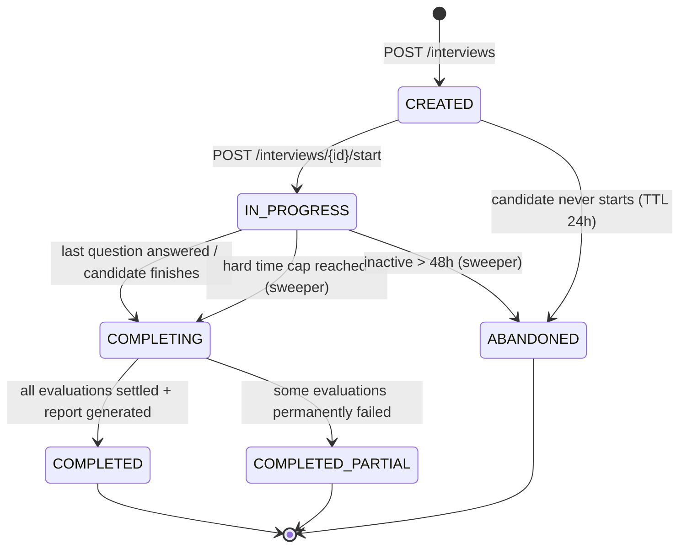
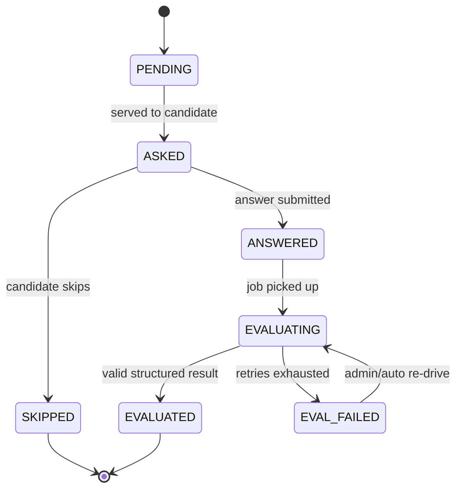
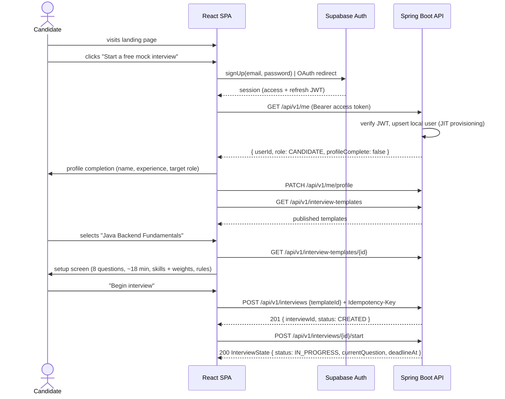
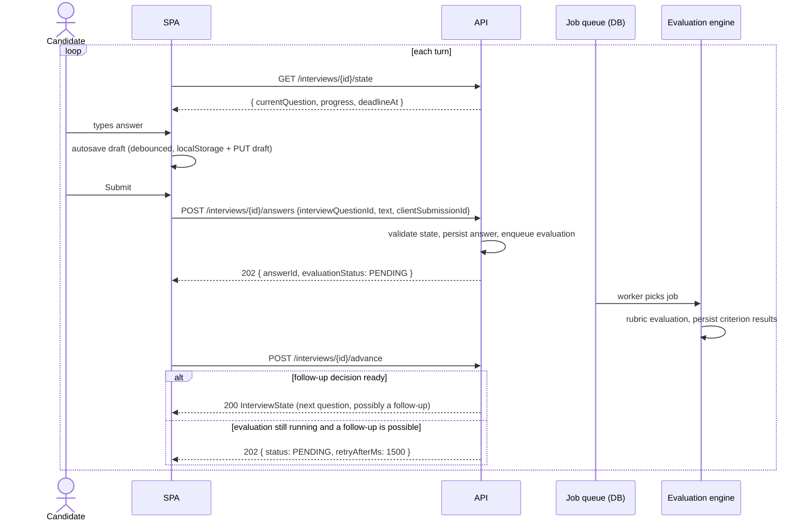
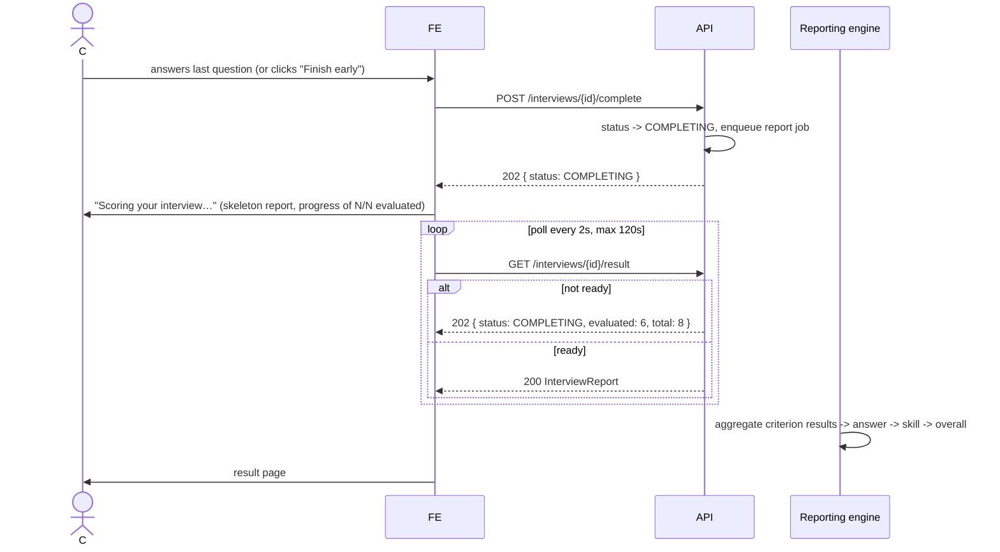
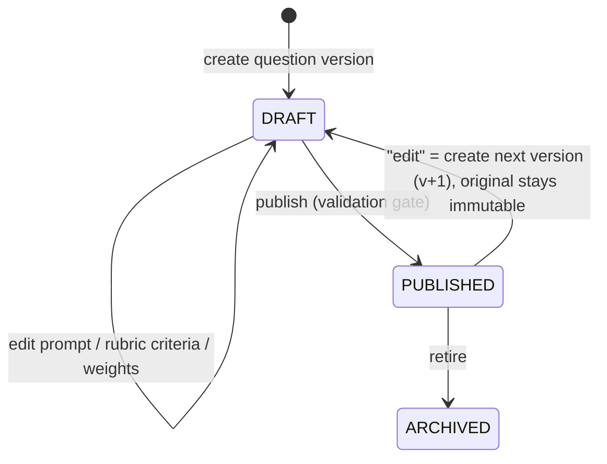

# 02 — User Flows & Interview State Model

> Status: Draft for approval · Depends on: 01
> **REVISED BY [10-architecture-review.md](10-architecture-review.md).** Where this document and doc 10 conflict, **doc 10 wins** — read doc 10 before implementing anything from this file.

## 1. Reasoning

Flows are specified **server-state-first**. The recurring failure mode in interview
products is a client that holds "which question am I on" in React state: refresh
loses it, two tabs diverge, a dropped connection double-submits, and voice mode
later becomes impossible.

**Rule: the interview has exactly one authoritative representation — a row set in
Postgres — and exactly one way for the client to learn it: `GET /interviews/{id}/state`.**
Every screen below is a projection of that state. This is why the flows are written
as state transitions rather than as wireframe sequences.

## 2. Interview attempt state machine



Notes and reasoning:

- `CREATED` vs `IN_PROGRESS` is deliberate. Creation reserves the attempt and
  materialises the plan (question selection) so the setup screen can show real
  content; the clock starts only at `start`. It also makes creation idempotent and
  cheap to retry.
- `COMPLETING` exists because evaluations are asynchronous. Without it the client
  cannot distinguish "we're computing your report" from "your report is broken".
- `COMPLETED_PARTIAL` is honest: if one answer could not be evaluated after retries,
  we score the rest, mark the gap visibly, and exclude it from the weighted average
  rather than silently scoring it 0.
- Only `IN_PROGRESS` accepts answers. Everything else returns `409 Conflict` with a
  Problem Details body — this is the concurrency guard for double-submit and
  back-button replays.

### 2.1 Per-turn (interview_question) state machine



## 3. Candidate flows

### 3.1 Landing → signup → first interview (happy path)



**Design decisions embedded here**

- *JIT user provisioning on first authenticated call*, not a webhook from Supabase.
  Webhooks add an availability dependency and a replay-security problem for one row.
- *Profile completion is a separate step, skippable.* Blocking signup on a form
  costs conversion; the profile only affects question difficulty defaults.
- *Setup screen is mandatory.* Candidates who understand the rules complete more
  interviews and complain less about scoring.

### 3.2 The answer loop



**Why `advance` is a separate POST rather than a response field on the answer**

1. It is the natural idempotency boundary: advancing twice must not skip a question.
2. It lets the server wait *only when it must* — if the current turn has no
   follow-up budget left, `advance` returns instantly without touching the LLM path.
3. Voice mode later needs exactly this: "I've finished speaking, what's next".

**Why `202 PENDING` instead of blocking the HTTP call**

Blocking ties an HTTP thread to a model call for 3–12 s. At 50 concurrent candidates
that is a dead app. Polling with `retryAfterMs` is unglamorous, has no infrastructure
cost, and degrades gracefully. SSE/WebSocket is a Phase 1 optimisation and needs no
API change (`advance` remains the fallback).

**Follow-up gating rule (Phase 0)**

A follow-up is asked only when *all* hold: `follow_up_needed = true` from the
evaluation, follow-ups used for this topic < 2, follow-ups used in this interview < 4,
elapsed time < 70% of the target duration, and evaluation confidence ≥ threshold.
The rule lives in the interview engine (backend code), **not** in the prompt.

### 3.3 Completion → result



The waiting screen must show *real* progress (`6 of 8 answers evaluated`), not a
spinner. It is the moment the product either feels substantial or feels like a toy.

### 3.4 Result page information hierarchy

1. **Overall score** + band (Needs work / Developing / Solid / Strong) + attempt
   number and date.
2. **Per-skill bars** with weight shown — this is the reusable "skill profile" seed.
3. **Top 3 strengths / Top 3 gaps**, each citing a question and a quoted span.
4. **Question-by-question accordion**: question → your answer → criteria met /
   partially met / missed → evidence → what a strong answer covers.
5. **What to study next** — derived from missing criteria, grouped by skill.

Explicitly *not* on the page: raw model output, confidence numbers, token counts.
Those live in admin.

### 3.5 History

`GET /interviews?status=COMPLETED` → table of attempts (date, template, score,
duration, skills). Trend line across attempts is deferred to Phase 1 but the data
model supports it from day one.

## 4. Admin flows

### 4.1 Question authoring (the flow most likely to be got wrong)



Publish validation gate (server-enforced):

- ≥ 3 rubric criteria, ≤ 10
- criterion weights sum to a positive number; no zero-weight criterion
- every criterion has a `code`, `label` and a *description written as an observable
  claim* ("states that HashMap is not thread-safe"), not a topic label ("thread safety")
- a reference answer exists (used for prompt grounding and admin review, never shown
  to the candidate mid-interview)
- primary skill assigned

**Published question versions are immutable.** Editing creates v+1. Live interviews
keep the version they were served. This is the only way historical scores stay
meaningful (risk R11).

### 4.2 Template authoring

```
Draft template
  → add skills with weights (must sum to 100)
  → add question slots: pick skill + difficulty + count, and/or pin specific questions
  → set config: question count, follow-up budget, target/hard duration
  → preview: server resolves a sample plan and shows expected coverage
  → publish (validation gate)
```

Template publish gate: weights sum to 100; enough published questions exist in the
bank to satisfy every slot with ≥ 2× headroom (otherwise every candidate gets the
same interview); duration plausibility check (`questions × 2 min ≤ target`).

**Editing a published template creates a new template version.** Running interviews
stay pinned to the version they started with.

### 4.3 Evaluation inspection

Admin → interview → question → answer shows, side by side:
the rubric criteria, the model's verdict per criterion, the evidence span highlighted
inside the candidate's answer, the derived arithmetic (weight × verdict value),
and the provenance footer (model id, prompt version, rubric version, latency, tokens,
cost, invocation id). A **"re-evaluate"** action re-runs the answer and stores a new
evaluation *without deleting the old one* — evaluations are append-only, with the
latest marked current.

## 5. Edge cases and failure flows

These are requirements, not afterthoughts.

| # | Situation | Behaviour |
|---|---|---|
| E1 | Browser refresh mid-interview | `GET /state` restores exactly; draft answer restored from server draft, falling back to localStorage |
| E2 | Two tabs open | Both read the same state; the second submit for a turn returns the first answer with `duplicate: true` (idempotent, not an error) |
| E3 | Double-click Submit | Same as E2 via `clientSubmissionId` unique constraint |
| E4 | Network drop during submit | Client retries with the same `clientSubmissionId`; server upserts |
| E5 | Candidate closes the tab and returns in 10 min | Resume banner on dashboard; clock kept running (honest) but hard cap enforced |
| E6 | Candidate returns after 3 days | Attempt was swept to `ABANDONED`; results shown as partial, retake offered |
| E7 | Evaluation fails permanently for one answer | Turn marked `EVAL_FAILED`; report excludes it from the weighted average and states so; admin can re-drive |
| E8 | AI provider down for the whole interview | Interview still completes; report is `PENDING_EVALUATION`; jobs drain when the provider recovers; candidate is emailed/notified in Phase 1, sees a clear banner in Phase 0 |
| E9 | Candidate submits an empty answer | Blocked client-side; server treats blank as `SKIPPED` explicitly |
| E10 | Candidate pastes a prompt injection | Treated as ordinary answer text; evaluation is schema-bounded; injection attempt flagged for review (08 §9) |
| E11 | Hard time cap hit while typing | Server rejects the answer with `409 INTERVIEW_EXPIRED`; client shows what happened and moves to the report. Draft is preserved and shown in the report as "unsubmitted" |
| E12 | Admin archives a question mid-interview | No effect — the interview holds a pinned `question_version_id` |
| E13 | Candidate opens another candidate's result URL | `404` (not `403`) — no existence disclosure |
| E14 | Report generation fails | Attempt stays `COMPLETING`; job retries with backoff; admin alert after 3 failures |

## 6. Screen inventory (Phase 0)

| Route | Screen | Access |
|---|---|---|
| `/` | Landing | Public |
| `/login`, `/signup`, `/auth/callback` | Auth | Public |
| `/app` | Candidate dashboard | Candidate |
| `/app/profile` | Profile | Candidate |
| `/app/interviews` | Template catalogue | Candidate |
| `/app/interviews/:templateId` | Template detail / setup | Candidate |
| `/app/attempts/:id/run` | **Interview runner** (focused, chrome-free) | Candidate, owner |
| `/app/attempts/:id/result` | Result / report | Candidate, owner |
| `/app/history` | Attempt history | Candidate |
| `/admin` | Admin dashboard | Admin |
| `/admin/candidates`, `/admin/candidates/:id` | Candidates | Admin |
| `/admin/attempts`, `/admin/attempts/:id` | Attempt inspection | Admin |
| `/admin/templates`, `/admin/templates/:id` | Template authoring | Admin |
| `/admin/questions`, `/admin/questions/:id` | Question bank | Admin |

The runner is a distinct layout: no nav, no notifications, one column, visible
progress and timer. Interview screens should feel like an exam, not like a dashboard.

## 7. Assumptions

- Polling (1.5–2 s) is acceptable for Phase 0; no realtime transport needed.
- Candidates use a desktop or tablet browser for the interview itself (the runner is
  responsive but optimised ≥ 768 px); dashboard and results are fully mobile-usable.
- Email notifications are out of scope in Phase 0; all status is in-app.

## 8. Risks specific to flows

| Risk | Mitigation |
|---|---|
| Polling storms if the client retries too fast | Server dictates `retryAfterMs`; client honours it; rate limit on `advance` |
| Candidate perceives the wait after "Finish" as a hang | Real progress counter + partial report skeleton |
| Abandoned attempts accumulate and skew metrics | Sweeper job + `ABANDONED` excluded from completion-rate denominator after 48 h |
| Admin edits break in-flight interviews | Immutable published versions (§4.1, §4.2) |
