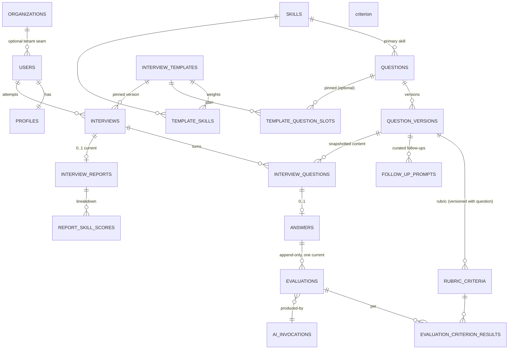

# 04 — Database Design (PostgreSQL)

> Status: Draft for approval · Depends on: 01, 02

## 1. Reasoning and ground rules

The database is the highest-coupling artefact in the system and the hardest thing to
change once real candidate results exist. It gets designed properly now.

**Ground rules**

| Rule | Reason |
|---|---|
| Core business data is relational. JSON is only for provider payloads and non-queried config | Queryability, constraints, and the ability to compute scores in SQL. A `results jsonb` column would make "average Java score across candidates" a Phase-1 rewrite |
| **Template ≠ Attempt**, enforced structurally | A template is authored content; an attempt is an immutable historical record. Confusing them is the classic failure of assessment products |
| Published content is **immutable**; edits create a new version | Historical scores must stay meaningful (01 R11) |
| Attempts **snapshot** the versions they used | Reproducibility and audit |
| `timestamptz` everywhere, UTC | No local-time bugs across regions |
| Money-free integers for weights (basis points) | No float drift; `SUM(weight_bp) = 10000` is a checkable invariant |
| Text + `CHECK` constraints instead of Postgres `ENUM` types | Adding/removing a state is a normal migration; PG enums cannot drop or reorder values and are awkward with JPA |
| UUID primary keys, **UUIDv7 generated in the application** | Non-guessable IDs in URLs, no cross-service collisions, and time-ordering keeps B-tree inserts local (plain v4 fragments indexes badly at volume). `gen_random_uuid()` is the DB-side default fallback |
| No foreign keys into Supabase's `auth.*` schema | Portability (01 R7). We hold `auth_subject` as an opaque external identifier |
| Own schema `app`, not `public` | Keeps our objects separate from Supabase-managed ones; makes a lift-and-shift to plain Postgres trivial |
| No soft-delete columns; lifecycle is modelled with `status` | Soft delete leaks into every query and eventually gets forgotten in one |

## 2. Entity–relationship overview



## 3. Schema

All DDL below is the intended Flyway `V1__baseline.sql` content (abridged of
comments). Naming: snake_case, plural tables, `<table>_id` FKs, `ix_`/`uq_`/`ck_`
prefixes for indexes and constraints.

### 3.1 Foundation

```sql
CREATE SCHEMA IF NOT EXISTS app;
CREATE EXTENSION IF NOT EXISTS pgcrypto;   -- gen_random_uuid()
CREATE EXTENSION IF NOT EXISTS citext;     -- case-insensitive email

-- Object creation order in V1: extensions -> organizations -> users -> profiles
-- -> skills -> questions -> templates -> interviews -> answers -> ai_invocations
-- -> evaluations -> reports -> operational tables. `evaluations.ai_invocation_id`
-- is shown inline below for readability but is added as a separate
-- ALTER TABLE ... ADD CONSTRAINT at the end of the migration, because
-- ai_invocations references answers and evaluations references ai_invocations.

-- Reusable audit columns are repeated explicitly (no inheritance, no triggers
-- in Phase 0 beyond updated_at) for clarity.
CREATE OR REPLACE FUNCTION app.touch_updated_at() RETURNS trigger AS $$
BEGIN NEW.updated_at = now(); RETURN NEW; END;
$$ LANGUAGE plpgsql;
```

### 3.2 Tenancy seam and identity

```sql
-- SEAM ONLY in Phase 0: created, never populated by product flows except a single
-- system row. Exists so institutes/companies are an additive migration later.
CREATE TABLE app.organizations (
    id           uuid PRIMARY KEY DEFAULT gen_random_uuid(),
    slug         text NOT NULL UNIQUE,
    name         text NOT NULL,
    type         text NOT NULL DEFAULT 'PLATFORM'
                 CHECK (type IN ('PLATFORM','INSTITUTE','COMPANY')),
    status       text NOT NULL DEFAULT 'ACTIVE'
                 CHECK (status IN ('ACTIVE','SUSPENDED')),
    created_at   timestamptz NOT NULL DEFAULT now(),
    updated_at   timestamptz NOT NULL DEFAULT now()
);

CREATE TABLE app.users (
    id              uuid PRIMARY KEY DEFAULT gen_random_uuid(),
    -- Opaque identifier from the external IdP (Supabase `sub`). NOT a FK.
    auth_subject    text NOT NULL,
    auth_provider   text NOT NULL DEFAULT 'supabase',
    email           citext NOT NULL,
    email_verified  boolean NOT NULL DEFAULT false,
    display_name    text,
    -- Authoritative role. NEVER trusted from a JWT claim (see 08 §4).
    role            text NOT NULL DEFAULT 'CANDIDATE'
                    CHECK (role IN ('CANDIDATE','ADMIN')),
    status          text NOT NULL DEFAULT 'ACTIVE'
                    CHECK (status IN ('ACTIVE','SUSPENDED','DELETED')),
    organization_id uuid REFERENCES app.organizations(id),   -- seam, nullable
    last_seen_at    timestamptz,
    created_at      timestamptz NOT NULL DEFAULT now(),
    updated_at      timestamptz NOT NULL DEFAULT now(),
    CONSTRAINT uq_users_auth UNIQUE (auth_provider, auth_subject),
    CONSTRAINT uq_users_email UNIQUE (email)
);
CREATE INDEX ix_users_org ON app.users(organization_id) WHERE organization_id IS NOT NULL;

CREATE TABLE app.profiles (
    user_id            uuid PRIMARY KEY REFERENCES app.users(id) ON DELETE CASCADE,
    full_name          text,
    headline           text,
    years_experience   smallint CHECK (years_experience BETWEEN 0 AND 50),
    target_role        text,
    -- Small, non-queried preference bag: genuinely good JSON use.
    preferences        jsonb NOT NULL DEFAULT '{}'::jsonb,
    created_at         timestamptz NOT NULL DEFAULT now(),
    updated_at         timestamptz NOT NULL DEFAULT now()
);
```

`citext` requires `CREATE EXTENSION citext` — available on Supabase. If unavailable
on a future host, fall back to `text` + a unique index on `lower(email)`.

### 3.3 Skills and question bank

```sql
CREATE TABLE app.skills (
    id           uuid PRIMARY KEY DEFAULT gen_random_uuid(),
    code         text NOT NULL UNIQUE,          -- 'JAVA', 'SPRING_BOOT', 'SQL', ...
    name         text NOT NULL,
    category     text NOT NULL DEFAULT 'ENGINEERING',
    description  text,
    status       text NOT NULL DEFAULT 'ACTIVE' CHECK (status IN ('ACTIVE','ARCHIVED')),
    sort_order   smallint NOT NULL DEFAULT 100,
    created_at   timestamptz NOT NULL DEFAULT now(),
    updated_at   timestamptz NOT NULL DEFAULT now()
);

-- Question FAMILY: stable identity across versions.
CREATE TABLE app.questions (
    id                uuid PRIMARY KEY DEFAULT gen_random_uuid(),
    question_key      text NOT NULL UNIQUE,     -- human-stable, e.g. 'java.hashmap-vs-chm'
    primary_skill_id  uuid NOT NULL REFERENCES app.skills(id),
    question_type     text NOT NULL DEFAULT 'CONCEPTUAL'
                      CHECK (question_type IN ('CONCEPTUAL','SCENARIO','DESIGN','TROUBLESHOOTING')),
    difficulty        text NOT NULL
                      CHECK (difficulty IN ('EASY','MEDIUM','HARD')),
    status            text NOT NULL DEFAULT 'ACTIVE'
                      CHECK (status IN ('ACTIVE','ARCHIVED')),
    organization_id   uuid REFERENCES app.organizations(id),  -- seam: private banks later
    created_by        uuid REFERENCES app.users(id),
    created_at        timestamptz NOT NULL DEFAULT now(),
    updated_at        timestamptz NOT NULL DEFAULT now()
);
CREATE INDEX ix_questions_skill_diff ON app.questions(primary_skill_id, difficulty, status);

-- Question CONTENT: immutable once PUBLISHED.
CREATE TABLE app.question_versions (
    id                    uuid PRIMARY KEY DEFAULT gen_random_uuid(),
    question_id           uuid NOT NULL REFERENCES app.questions(id) ON DELETE CASCADE,
    version               integer NOT NULL CHECK (version >= 1),
    prompt_text           text NOT NULL CHECK (length(prompt_text) BETWEEN 10 AND 4000),
    context_text          text,                -- optional scenario/setup shown above the question
    reference_answer      text NOT NULL,       -- grounding for evaluation + admin review; never shown mid-interview
    expected_duration_sec integer NOT NULL DEFAULT 120 CHECK (expected_duration_sec BETWEEN 30 AND 900),
    status                text NOT NULL DEFAULT 'DRAFT'
                          CHECK (status IN ('DRAFT','PUBLISHED','ARCHIVED')),
    published_at          timestamptz,
    created_by            uuid REFERENCES app.users(id),
    created_at            timestamptz NOT NULL DEFAULT now(),
    updated_at            timestamptz NOT NULL DEFAULT now(),
    CONSTRAINT uq_qv_question_version UNIQUE (question_id, version),
    CONSTRAINT ck_qv_published_at CHECK (status <> 'PUBLISHED' OR published_at IS NOT NULL)
);
-- At most one PUBLISHED version per question family at a time.
CREATE UNIQUE INDEX uq_qv_one_published
    ON app.question_versions(question_id) WHERE status = 'PUBLISHED';

-- The rubric. Versioned WITH the question version: a rubric change IS a content change.
CREATE TABLE app.rubric_criteria (
    id                  uuid PRIMARY KEY DEFAULT gen_random_uuid(),
    question_version_id uuid NOT NULL REFERENCES app.question_versions(id) ON DELETE CASCADE,
    code                text NOT NULL,        -- 'THREAD_SAFETY', stable within the version
    label               text NOT NULL,        -- shown in the report
    -- Written as an OBSERVABLE CLAIM the answer either makes or doesn't.
    expectation         text NOT NULL,
    weight_bp           integer NOT NULL CHECK (weight_bp > 0 AND weight_bp <= 10000),
    tier                text NOT NULL DEFAULT 'CORE'
                        CHECK (tier IN ('CORE','DEPTH','BONUS')),
    sort_order          smallint NOT NULL DEFAULT 100,
    created_at          timestamptz NOT NULL DEFAULT now(),
    CONSTRAINT uq_rc_code UNIQUE (question_version_id, code)
);
CREATE INDEX ix_rc_qv ON app.rubric_criteria(question_version_id, sort_order);

-- Curated follow-up prompts, chosen by the interview engine when a criterion is weak.
CREATE TABLE app.follow_up_prompts (
    id                   uuid PRIMARY KEY DEFAULT gen_random_uuid(),
    question_version_id  uuid NOT NULL REFERENCES app.question_versions(id) ON DELETE CASCADE,
    -- Which weakness this follow-up probes. NULL = generic depth probe.
    rubric_criterion_id  uuid REFERENCES app.rubric_criteria(id) ON DELETE CASCADE,
    prompt_text          text NOT NULL,
    sort_order           smallint NOT NULL DEFAULT 100,
    created_at           timestamptz NOT NULL DEFAULT now()
);
```

**Why the rubric hangs off `question_versions`, not `questions`:** a rubric edit
changes what the score *means*. Making it a separate version chain
(`question_rubrics` with its own version) is the alternative; it adds a join and a
second lifecycle for no benefit, because we never want a published question with a
swappable rubric. `rubric_version` in the audit trail is therefore
`question_version.id` + `version`, recorded explicitly on the evaluation.

**Weight invariant:** `SUM(weight_bp)` per `question_version_id` must equal 10000.
Enforced at publish time in the application (a DB-level check would need a trigger or
a deferred constraint; the publish gate is a single well-tested code path, and the
invariant is re-asserted by a nightly consistency check).

### 3.4 Interview templates

```sql
CREATE TABLE app.interview_templates (
    id                  uuid PRIMARY KEY DEFAULT gen_random_uuid(),
    template_key        text NOT NULL,          -- stable family key
    version             integer NOT NULL CHECK (version >= 1),
    title               text NOT NULL,
    summary             text,
    description         text,
    level               text NOT NULL DEFAULT 'MID'
                        CHECK (level IN ('ENTRY','JUNIOR','MID','SENIOR')),
    status              text NOT NULL DEFAULT 'DRAFT'
                        CHECK (status IN ('DRAFT','PUBLISHED','ARCHIVED')),
    -- Engine configuration (01 §8). Flat columns, not JSON: these are queried,
    -- validated and displayed.
    core_question_count       smallint NOT NULL DEFAULT 8  CHECK (core_question_count BETWEEN 3 AND 20),
    max_follow_ups_per_topic  smallint NOT NULL DEFAULT 2  CHECK (max_follow_ups_per_topic BETWEEN 0 AND 3),
    max_follow_ups_total      smallint NOT NULL DEFAULT 4  CHECK (max_follow_ups_total BETWEEN 0 AND 10),
    target_duration_min       smallint NOT NULL DEFAULT 18 CHECK (target_duration_min BETWEEN 5 AND 120),
    hard_duration_min         smallint NOT NULL DEFAULT 45 CHECK (hard_duration_min BETWEEN 5 AND 180),
    passing_score             numeric(4,2) CHECK (passing_score IS NULL OR passing_score BETWEEN 0 AND 10),
    organization_id     uuid REFERENCES app.organizations(id),   -- seam
    visibility          text NOT NULL DEFAULT 'PUBLIC'
                        CHECK (visibility IN ('PUBLIC','ORGANIZATION','PRIVATE')),
    published_at        timestamptz,
    created_by          uuid REFERENCES app.users(id),
    created_at          timestamptz NOT NULL DEFAULT now(),
    updated_at          timestamptz NOT NULL DEFAULT now(),
    CONSTRAINT uq_tpl_key_version UNIQUE (template_key, version),
    CONSTRAINT ck_tpl_durations CHECK (hard_duration_min >= target_duration_min)
);
CREATE UNIQUE INDEX uq_tpl_one_published
    ON app.interview_templates(template_key) WHERE status = 'PUBLISHED';
CREATE INDEX ix_tpl_browse ON app.interview_templates(status, visibility, level);

CREATE TABLE app.template_skills (
    template_id  uuid NOT NULL REFERENCES app.interview_templates(id) ON DELETE CASCADE,
    skill_id     uuid NOT NULL REFERENCES app.skills(id),
    weight_bp    integer NOT NULL CHECK (weight_bp > 0 AND weight_bp <= 10000),
    PRIMARY KEY (template_id, skill_id)
);

-- One ordered row per core question the attempt will contain.
-- selection_mode unifies "pin this exact question" and "pick one from this pool".
CREATE TABLE app.template_question_slots (
    id             uuid PRIMARY KEY DEFAULT gen_random_uuid(),
    template_id    uuid NOT NULL REFERENCES app.interview_templates(id) ON DELETE CASCADE,
    position       smallint NOT NULL CHECK (position >= 1),
    selection_mode text NOT NULL CHECK (selection_mode IN ('PINNED','POOL')),
    question_id    uuid REFERENCES app.questions(id),   -- required when PINNED
    skill_id       uuid REFERENCES app.skills(id),      -- required when POOL
    difficulty     text CHECK (difficulty IN ('EASY','MEDIUM','HARD')),
    question_type  text CHECK (question_type IN ('CONCEPTUAL','SCENARIO','DESIGN','TROUBLESHOOTING')),
    weight_bp      integer NOT NULL CHECK (weight_bp > 0),
    CONSTRAINT uq_tqs_position UNIQUE (template_id, position),
    CONSTRAINT ck_tqs_mode CHECK (
        (selection_mode = 'PINNED' AND question_id IS NOT NULL) OR
        (selection_mode = 'POOL'   AND skill_id    IS NOT NULL)
    )
);
```

Invariants asserted at publish: `SUM(template_skills.weight_bp) = 10000`;
`COUNT(slots) = core_question_count`; every `POOL` slot has ≥ 2× candidate questions
available; every skill referenced by a slot appears in `template_skills`.

### 3.5 Interview attempts (the historical record)

```sql
CREATE TABLE app.interviews (
    id                     uuid PRIMARY KEY DEFAULT gen_random_uuid(),
    candidate_user_id      uuid NOT NULL REFERENCES app.users(id),
    -- Snapshot: the exact template VERSION row, never the family key.
    template_id            uuid NOT NULL REFERENCES app.interview_templates(id),
    organization_id        uuid REFERENCES app.organizations(id),        -- seam
    attempt_number         integer NOT NULL DEFAULT 1 CHECK (attempt_number >= 1),
    status                 text NOT NULL DEFAULT 'CREATED'
                           CHECK (status IN ('CREATED','IN_PROGRESS','COMPLETING',
                                             'COMPLETED','COMPLETED_PARTIAL','ABANDONED')),
    -- Denormalised config snapshot: template versions are immutable, but copying
    -- these three makes attempt replay independent of template joins.
    core_question_count    smallint NOT NULL,
    max_follow_ups_total   smallint NOT NULL,
    hard_deadline_at       timestamptz,
    created_at             timestamptz NOT NULL DEFAULT now(),
    started_at             timestamptz,
    last_activity_at       timestamptz,
    completed_at           timestamptz,
    -- Set only when status = COMPLETED/COMPLETED_PARTIAL; the report holds detail.
    final_score            numeric(4,2) CHECK (final_score IS NULL OR final_score BETWEEN 0 AND 10),
    engine_version         text NOT NULL,      -- interview engine build that ran it
    updated_at             timestamptz NOT NULL DEFAULT now(),
    CONSTRAINT uq_interview_attempt UNIQUE (candidate_user_id, template_id, attempt_number),
    CONSTRAINT ck_interview_started CHECK (status = 'CREATED' OR started_at IS NOT NULL)
);
CREATE INDEX ix_interviews_candidate ON app.interviews(candidate_user_id, created_at DESC);
CREATE INDEX ix_interviews_status ON app.interviews(status, last_activity_at);
-- A candidate may have at most one live attempt at a time (product rule).
CREATE UNIQUE INDEX uq_interviews_one_live
    ON app.interviews(candidate_user_id)
    WHERE status IN ('CREATED','IN_PROGRESS','COMPLETING');

-- One row per TURN. Core questions are materialised at start; follow-ups appended.
CREATE TABLE app.interview_questions (
    id                    uuid PRIMARY KEY DEFAULT gen_random_uuid(),
    interview_id          uuid NOT NULL REFERENCES app.interviews(id) ON DELETE CASCADE,
    position              integer NOT NULL CHECK (position >= 1),
    kind                  text NOT NULL CHECK (kind IN ('CORE','FOLLOW_UP')),
    parent_id             uuid REFERENCES app.interview_questions(id) ON DELETE CASCADE,
    -- Pinned content snapshot. Immutable for the life of the attempt.
    question_version_id   uuid NOT NULL REFERENCES app.question_versions(id),
    skill_id              uuid NOT NULL REFERENCES app.skills(id),
    weight_bp             integer NOT NULL CHECK (weight_bp >= 0),
    -- Follow-ups carry their own prompt text (curated row, or engine-composed).
    follow_up_prompt_id   uuid REFERENCES app.follow_up_prompts(id),
    prompt_text_override  text,
    status                text NOT NULL DEFAULT 'PENDING'
                          CHECK (status IN ('PENDING','ASKED','ANSWERED','SKIPPED',
                                            'EVALUATING','EVALUATED','EVAL_FAILED')),
    asked_at              timestamptz,
    answered_at           timestamptz,
    created_at            timestamptz NOT NULL DEFAULT now(),
    updated_at            timestamptz NOT NULL DEFAULT now(),
    CONSTRAINT uq_iq_position UNIQUE (interview_id, position),
    CONSTRAINT ck_iq_followup CHECK (
        (kind = 'CORE' AND parent_id IS NULL) OR
        (kind = 'FOLLOW_UP' AND parent_id IS NOT NULL)
    )
);
CREATE INDEX ix_iq_interview ON app.interview_questions(interview_id, position);

CREATE TABLE app.answers (
    id                     uuid PRIMARY KEY DEFAULT gen_random_uuid(),
    interview_question_id  uuid NOT NULL REFERENCES app.interview_questions(id) ON DELETE CASCADE,
    -- Normalised text is what the evaluation engine consumes, whatever the modality.
    content_text           text NOT NULL,
    -- VOICE SEAM: modality + optional media/transcript reference. Text-only in Phase 0.
    input_mode             text NOT NULL DEFAULT 'TEXT'
                           CHECK (input_mode IN ('TEXT','VOICE')),
    media_uri              text,
    transcript_confidence  numeric(4,3),
    char_count             integer NOT NULL,
    time_spent_sec         integer CHECK (time_spent_sec >= 0),
    -- Idempotency: client-generated, unique per turn.
    client_submission_id   text NOT NULL,
    submitted_at           timestamptz NOT NULL DEFAULT now(),
    CONSTRAINT uq_answers_turn UNIQUE (interview_question_id),
    CONSTRAINT uq_answers_client_sub UNIQUE (interview_question_id, client_submission_id)
);
```

`uq_answers_turn` is the structural guarantee that one turn has at most one answer —
double-submit becomes a database-level impossibility, not a race the service hopes to
win. Drafts are *not* answers; they live in `app.answer_drafts` (below) and are
deleted on submit.

```sql
CREATE TABLE app.answer_drafts (
    interview_question_id uuid PRIMARY KEY REFERENCES app.interview_questions(id) ON DELETE CASCADE,
    content_text          text NOT NULL,
    updated_at            timestamptz NOT NULL DEFAULT now()
);
```

### 3.6 Evaluations

```sql
CREATE TABLE app.evaluations (
    id                    uuid PRIMARY KEY DEFAULT gen_random_uuid(),
    answer_id             uuid NOT NULL REFERENCES app.answers(id) ON DELETE CASCADE,
    -- Append-only: re-evaluations add rows. Exactly one current per answer.
    is_current            boolean NOT NULL DEFAULT true,
    status                text NOT NULL
                          CHECK (status IN ('SUCCEEDED','FAILED_VALIDATION','FAILED_PROVIDER','SKIPPED')),
    -- DERIVED BY THE BACKEND from criterion results. Never taken from the model.
    derived_score         numeric(4,2) CHECK (derived_score IS NULL OR derived_score BETWEEN 0 AND 10),
    -- The model's own holistic score, stored ONLY as a divergence signal.
    model_reported_score  numeric(4,2),
    confidence            numeric(4,3) CHECK (confidence IS NULL OR confidence BETWEEN 0 AND 1),
    follow_up_needed      boolean NOT NULL DEFAULT false,
    follow_up_reason      text,
    summary               text,
    -- REPRODUCIBILITY QUARTET (01 §2)
    evaluation_version    text NOT NULL,   -- our scoring algorithm version, e.g. 'eval-1.0.0'
    prompt_version        text NOT NULL,   -- e.g. 'rubric-eval@2026-09-01.3'
    rubric_version        integer NOT NULL, -- question_versions.version used
    question_version_id   uuid NOT NULL REFERENCES app.question_versions(id),
    ai_invocation_id      uuid,   -- FK added at end of V1 (see §3.1 ordering note)
    error_code            text,
    error_detail          text,
    attempt_count         smallint NOT NULL DEFAULT 1,
    created_at            timestamptz NOT NULL DEFAULT now()
);
CREATE UNIQUE INDEX uq_eval_one_current
    ON app.evaluations(answer_id) WHERE is_current;
CREATE INDEX ix_eval_answer ON app.evaluations(answer_id, created_at DESC);

CREATE TABLE app.evaluation_criterion_results (
    id                   uuid PRIMARY KEY DEFAULT gen_random_uuid(),
    evaluation_id        uuid NOT NULL REFERENCES app.evaluations(id) ON DELETE CASCADE,
    rubric_criterion_id  uuid NOT NULL REFERENCES app.rubric_criteria(id),
    verdict              text NOT NULL CHECK (verdict IN ('MET','PARTIAL','MISSING','CONTRADICTED')),
    -- Credit applied by the backend for this verdict (see 07 §6). Stored for audit.
    credit               numeric(4,3) NOT NULL CHECK (credit BETWEEN 0 AND 1),
    weight_bp            integer NOT NULL,          -- copied from the criterion at eval time
    confidence           numeric(4,3) CHECK (confidence BETWEEN 0 AND 1),
    -- Verbatim span from the candidate's answer supporting the verdict.
    evidence_quote       text,
    evidence_start       integer,
    evidence_end         integer,
    comment              text,
    CONSTRAINT uq_ecr UNIQUE (evaluation_id, rubric_criterion_id)
);
CREATE INDEX ix_ecr_eval ON app.evaluation_criterion_results(evaluation_id);
```

`CONTRADICTED` (candidate asserted something false) is separate from `MISSING`
(didn't mention it). They deserve different credit and very different feedback — a
wrong claim is worse than an omission, and collapsing them was a real risk.

### 3.7 Reports

```sql
CREATE TABLE app.interview_reports (
    id                    uuid PRIMARY KEY DEFAULT gen_random_uuid(),
    interview_id          uuid NOT NULL REFERENCES app.interviews(id) ON DELETE CASCADE,
    is_current            boolean NOT NULL DEFAULT true,
    overall_score         numeric(4,2) NOT NULL CHECK (overall_score BETWEEN 0 AND 10),
    band                  text NOT NULL CHECK (band IN ('NEEDS_WORK','DEVELOPING','SOLID','STRONG')),
    -- Coverage honesty: how much of the intended weight was actually evaluated.
    evaluated_weight_bp   integer NOT NULL,
    total_weight_bp       integer NOT NULL,
    questions_answered    smallint NOT NULL,
    questions_skipped     smallint NOT NULL,
    questions_failed      smallint NOT NULL,
    duration_sec          integer,
    summary               text NOT NULL,
    strengths             jsonb NOT NULL DEFAULT '[]'::jsonb,   -- ordered display list
    improvements          jsonb NOT NULL DEFAULT '[]'::jsonb,
    study_recommendations jsonb NOT NULL DEFAULT '[]'::jsonb,
    reporting_version     text NOT NULL,
    generated_at          timestamptz NOT NULL DEFAULT now()
);
CREATE UNIQUE INDEX uq_report_one_current
    ON app.interview_reports(interview_id) WHERE is_current;

CREATE TABLE app.report_skill_scores (
    id            uuid PRIMARY KEY DEFAULT gen_random_uuid(),
    report_id     uuid NOT NULL REFERENCES app.interview_reports(id) ON DELETE CASCADE,
    skill_id      uuid NOT NULL REFERENCES app.skills(id),
    score         numeric(4,2) NOT NULL CHECK (score BETWEEN 0 AND 10),
    weight_bp     integer NOT NULL,
    question_count smallint NOT NULL,
    coverage_bp   integer NOT NULL,     -- evaluated weight / intended weight for this skill
    CONSTRAINT uq_rss UNIQUE (report_id, skill_id)
);
```

`strengths` / `improvements` / `study_recommendations` are jsonb arrays of
`{title, detail, skillCode, interviewQuestionId?, criterionCode?}`. This is
**presentation output derived from relational data**, regenerable at any time — the
one place JSON is right, because the shape will change often and nothing queries
inside it. Every underlying fact remains relationally queryable.

The long-term "skill profile" (01 vision item 5) is a *query* over
`report_skill_scores` joined to `interviews`, not a new denormalised table. A
materialised `candidate_skill_profile` becomes worthwhile only when that query gets
slow — deliberately deferred.

### 3.8 AI accounting and operational tables

```sql
CREATE TABLE app.ai_invocations (
    id                 uuid PRIMARY KEY DEFAULT gen_random_uuid(),
    purpose            text NOT NULL
                       CHECK (purpose IN ('ANSWER_EVALUATION','FOLLOW_UP_SELECTION',
                                          'REPORT_SUMMARY','TRIAGE')),
    provider           text NOT NULL,        -- 'anthropic' | 'openai' | 'google' | 'mock'
    model              text NOT NULL,        -- exact pinned model id
    prompt_version     text NOT NULL,
    request_fingerprint text NOT NULL,       -- sha256 of (prompt template + inputs); dedupe + cache key
    status             text NOT NULL CHECK (status IN ('SUCCEEDED','TIMEOUT','PROVIDER_ERROR',
                                                       'RATE_LIMITED','INVALID_OUTPUT')),
    http_status        smallint,
    latency_ms         integer,
    input_tokens       integer,
    output_tokens      integer,
    cost_micros        bigint,               -- integer micro-USD, never float
    retry_index        smallint NOT NULL DEFAULT 0,
    -- Genuinely unstructured, provider-shaped, never queried by field: correct JSON use.
    raw_response       jsonb,
    error_detail       text,
    -- Correlation
    interview_id       uuid REFERENCES app.interviews(id) ON DELETE SET NULL,
    answer_id          uuid REFERENCES app.answers(id) ON DELETE SET NULL,
    user_id            uuid REFERENCES app.users(id) ON DELETE SET NULL,
    trace_id           text,
    created_at         timestamptz NOT NULL DEFAULT now()
);
CREATE INDEX ix_ai_inv_cost ON app.ai_invocations(created_at DESC);
CREATE INDEX ix_ai_inv_interview ON app.ai_invocations(interview_id);
CREATE INDEX ix_ai_inv_user_day ON app.ai_invocations(user_id, created_at DESC);

-- Database-backed job queue. Chosen over Redis/SQS/Kafka for Phase 0: transactional
-- with the business write (no lost jobs, no outbox drift), zero extra infrastructure.
-- SELECT ... FOR UPDATE SKIP LOCKED scales to thousands of jobs/min — far past Phase 0.
CREATE TABLE app.jobs (
    id             uuid PRIMARY KEY DEFAULT gen_random_uuid(),
    job_type       text NOT NULL
                   CHECK (job_type IN ('EVALUATE_ANSWER','GENERATE_REPORT','SWEEP_INTERVIEWS')),
    -- Natural dedupe key, e.g. 'EVALUATE_ANSWER:<answerId>'
    dedupe_key     text NOT NULL,
    payload        jsonb NOT NULL,
    status         text NOT NULL DEFAULT 'QUEUED'
                   CHECK (status IN ('QUEUED','RUNNING','SUCCEEDED','FAILED','DEAD')),
    priority       smallint NOT NULL DEFAULT 100,
    attempts       smallint NOT NULL DEFAULT 0,
    max_attempts   smallint NOT NULL DEFAULT 4,
    run_after      timestamptz NOT NULL DEFAULT now(),
    locked_by      text,
    locked_at      timestamptz,
    last_error     text,
    created_at     timestamptz NOT NULL DEFAULT now(),
    updated_at     timestamptz NOT NULL DEFAULT now(),
    CONSTRAINT uq_jobs_dedupe UNIQUE (dedupe_key)
);
CREATE INDEX ix_jobs_poll ON app.jobs(status, run_after, priority) WHERE status = 'QUEUED';

CREATE TABLE app.idempotency_keys (
    id             uuid PRIMARY KEY DEFAULT gen_random_uuid(),
    user_id        uuid NOT NULL REFERENCES app.users(id) ON DELETE CASCADE,
    endpoint       text NOT NULL,
    idem_key       text NOT NULL,
    request_hash   text NOT NULL,
    response_status smallint,
    response_body  jsonb,
    created_at     timestamptz NOT NULL DEFAULT now(),
    expires_at     timestamptz NOT NULL,
    CONSTRAINT uq_idem UNIQUE (user_id, endpoint, idem_key)
);
CREATE INDEX ix_idem_expiry ON app.idempotency_keys(expires_at);

CREATE TABLE app.audit_log (
    id           bigserial PRIMARY KEY,
    actor_user_id uuid REFERENCES app.users(id),
    actor_role   text,
    action       text NOT NULL,      -- 'QUESTION_PUBLISHED', 'EVALUATION_REDRIVEN', ...
    entity_type  text NOT NULL,
    entity_id    uuid,
    before_state jsonb,
    after_state  jsonb,
    ip_hash      text,               -- hashed, never raw IP (08 §7)
    trace_id     text,
    created_at   timestamptz NOT NULL DEFAULT now()
);
CREATE INDEX ix_audit_entity ON app.audit_log(entity_type, entity_id, created_at DESC);
CREATE INDEX ix_audit_actor ON app.audit_log(actor_user_id, created_at DESC);
```

## 4. Key design decisions, with the alternatives rejected

| # | Decision | Alternative rejected | Why |
|---|---|---|---|
| D1 | `question_versions` separate from `questions` | Single mutable `questions` table | An edit would silently rewrite the meaning of every historical score |
| D2 | Rubric criteria hang off the question **version** | Independent `question_rubrics` version chain | Two lifecycles for content that must move together; extra join, no benefit |
| D3 | `template_question_slots` with `PINNED`/`POOL` modes | Separate pinned-question and pool tables | One ordered plan is easier to render, validate and reason about |
| D4 | Attempts pin `question_version_id` per turn | Resolve at read time from the template | Read-time resolution makes an old report change when content changes |
| D5 | Criterion-level results as **rows** | `evaluation.details jsonb` | Enables "which concept do candidates miss most?" without JSON gymnastics; enables FK integrity to the criterion |
| D6 | `derived_score` computed by backend; `model_reported_score` stored separately | Trust the model's score | The core product commitment; keeping the model's number lets us monitor divergence as a quality signal |
| D7 | Evaluations append-only with `is_current` | Update in place | Re-evaluation must never destroy the record a candidate already saw |
| D8 | DB-backed `jobs` table | Redis / SQS / Kafka | Transactional with the business write; zero ops; `SKIP LOCKED` is enough for years |
| D9 | Partial unique indexes for "one live X" | Application-level checks | Races are eliminated structurally, not hopefully |
| D10 | `organizations` + nullable `organization_id` from day 1 | Add tenancy later | Retrofitting a tenant column onto live interviews/reports is a migration with downtime. Cost now: three nullable columns, zero code |
| D11 | Text + `CHECK` over PG `ENUM` | Native enums | Enum value removal/reordering requires type recreation; `CHECK` edits are ordinary migrations |
| D12 | Weights as integer basis points | `numeric` percentages / floats | Exact sums, exact invariant `= 10000` |
| D13 | Own `app` schema, no Supabase `auth.*` FKs | FK to `auth.users` | Portability; also avoids Supabase's schema being in our Flyway blast radius |
| D14 | No RLS as primary authorisation | Rely on Postgres RLS | Backend connects with one role; authorisation belongs in the application where it is testable and expressible. RLS may be added later as defence-in-depth (08 §5) |

## 5. Indexing and performance notes

Phase 0 volumes are tiny; these exist because they are cheap now and awkward later:

- Attempt listing: `ix_interviews_candidate (candidate_user_id, created_at DESC)`.
- Runner hot path: `ix_iq_interview (interview_id, position)` — the state endpoint is
  a single indexed scan of ≤ 12 rows.
- Job polling: partial index on `status = 'QUEUED'` keeps the queue index small
  regardless of history size.
- Question pool selection: `ix_questions_skill_diff`.
- Report reads: `report_skill_scores` by `report_id` (covered by the unique index).
- Deliberately **no** full-text index on answers in Phase 0. Add `pg_trgm`/FTS when
  admin search over answers actually exists.

Expected Phase 0 row growth per completed interview: 1 interview, ~10
interview_questions, ~10 answers, ~10 evaluations, ~50 criterion results, ~12 ai
invocations, 1 report, ~5 skill scores. 10 000 interviews ≈ 1 M rows total. Trivial.

## 6. Migrations

- **Flyway**, versioned SQL only (no Java migrations in Phase 0), in
  `backend/src/main/resources/db/migration`.
- `V1__baseline.sql` (schema), `V2__seed_skills.sql` (the 8 skills — reference data,
  belongs in migrations), then incremental `V3__...`.
- Question and template content is **not** migration data. It is loaded through a
  seed command hitting the admin API/service so it passes the same validation gates
  candidates' content does. Idempotent by `question_key`/`template_key`.
- Rules: never edit an applied migration; every migration is
  backwards-compatible for one release (expand → migrate → contract) so a rollback
  doesn't require a restore; destructive changes need an explicit approved step.
- `flyway.schemas=app`, `flyway.defaultSchema=app`. Migration runs on startup in
  dev; in production it runs as a separate step before the app rollout.
- A Testcontainers test asserts that migrations apply cleanly from scratch and that
  the resulting schema matches JPA's expectation (`ddl-auto: validate`, always).

## 7. Data lifecycle and retention

| Data | Retention | Reason |
|---|---|---|
| `answer_drafts` | Deleted on submit; swept after 7 days | Transient |
| `ai_invocations.raw_response` | 30 days, then nulled (row kept for accounting) | Contains the candidate's answer text; debugging value decays fast |
| Answers, evaluations, reports | Life of the account | It's the candidate's record |
| `audit_log` | 400 days | Investigation window |
| `idempotency_keys` | 24 h | Replay window |
| `jobs` (terminal) | 30 days | Debugging |
| Account deletion | Hard-delete profile/answers/drafts; anonymise `users` row (email → `deleted+<id>@…`, `auth_subject` → null, status `DELETED`); retain aggregate report scores without content | Honour deletion while keeping non-identifying analytics; detail in 08 §7 |

## 8. Assumptions

- Single logical database; no sharding, no read replica in Phase 0.
- Supabase Postgres 15+ with `pgcrypto` and `citext` available.
- Connection pooling via Supabase's pooler (transaction mode) — which means **no
  session-level features** (no `SET LOCAL` app context relied upon, no prepared
  statement caching assumptions). HikariCP sized small (10) accordingly.
- All access is through the application; no direct client-to-Postgres access from
  the browser (this is why RLS is not load-bearing).

## 9. Risks

| Risk | Mitigation |
|---|---|
| Publish-time invariants (weights = 10000) drift because they're app-enforced | Single publish code path + nightly consistency job + a test per invariant |
| `uq_interviews_one_live` blocks a candidate whose attempt is stuck | Sweeper moves stale attempts to `ABANDONED`; explicit "abandon and restart" action |
| Transaction-mode pooler breaks something subtle (advisory locks, `LISTEN/NOTIFY`) | Job queue uses `SKIP LOCKED`, not advisory locks or `LISTEN/NOTIFY` — chosen for exactly this reason |
| jsonb display fields become a dumping ground | Rule: nothing may be *queried* out of them; anything queried gets promoted to a column in a migration |
| Growth of `ai_invocations.raw_response` | 30-day nulling policy + monitor table size |
| UUID v7 library choice churn | Confined to one `IdGenerator` component |
