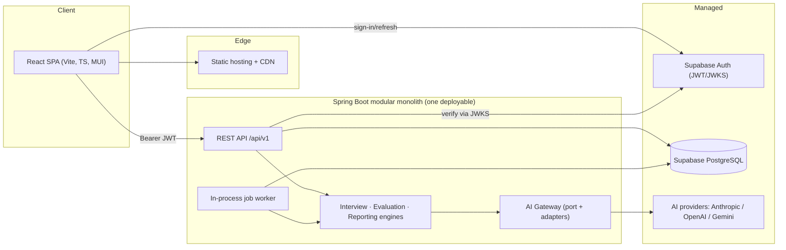
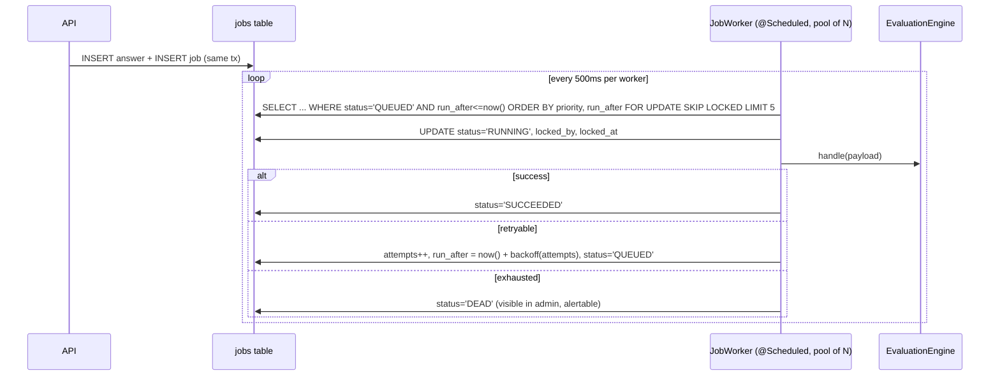

# 06 — System Architecture

> Status: Draft for approval · Depends on: 01–05

## 1. Shape of the system



**One deployable, one database, three managed dependencies.** Everything else is a
module boundary inside the process. Rationale: at Phase 0 the binding constraint is
evaluation quality and iteration speed, not throughput. Every piece of distributed
infrastructure we don't run is a week we spend on rubrics instead.

## 2. Why a modular monolith (and how we keep the option to split)

A monolith is not the same as an unstructured application. We get the deployment
simplicity of one artefact and the design discipline of separate services by making
module boundaries **compile-checked and test-enforced**, not aspirational.

Three enforcement mechanisms:

1. **Package structure is the boundary.** `com.<org>.interview.<module>.…`
2. **Only `<module>.api` is importable from outside the module.** Enforced by
   ArchUnit tests in CI (fails the build, not a review comment).
3. **No cross-module database access.** A module reads and writes only its own
   tables. Cross-module data comes from a published interface or a domain event.
   Enforced by a naming convention (`<module>` owns tables listed in
   `docs/04-database.md` §3) plus an ArchUnit rule that repositories may only be
   referenced from within their own module.

If the split ever happens, the work is: replace the in-process call with HTTP/queue,
and split the schema at boundaries that already have no joins across them.

**What we explicitly do not do:** separate Maven modules per domain in Phase 0. It
adds build complexity, IDE friction and version wrangling to enforce something
ArchUnit enforces for free. Single Maven module, package-enforced boundaries.
(Revisit if the team exceeds ~4 engineers.)

## 3. Module map

```
com.<org>.interview
├── shared/                       cross-cutting, depended on by everyone
│   ├── error/                    ProblemDetail mapping, error codes, exceptions
│   ├── web/                      pagination, envelopes, idempotency filter, trace filter
│   ├── security/                 JWT auth filter, CurrentUser, @RequiresRole
│   ├── persistence/              base entity, UUIDv7 IdGenerator, auditing
│   ├── time/                     Clock abstraction (never LocalDateTime.now() in code)
│   ├── jobs/                     job queue: enqueue, poll, retry, dead-letter
│   └── events/                   in-process domain event publisher
│
├── identity/                     users, roles, JIT provisioning, profiles
│   ├── api/                      MeController, UserDirectory (published interface)
│   ├── application/              UserProvisioningService, ProfileService
│   ├── domain/                   User, Profile, Role
│   └── infrastructure/           UserRepository, SupabaseTokenVerifier
│
├── catalog/                      skills + question bank + rubrics  ("question" module)
│   ├── api/                      QuestionAdminController, QuestionCatalog (published)
│   ├── application/              QuestionAuthoringService, PublishValidator, QuestionSelector
│   ├── domain/                   Question, QuestionVersion, RubricCriterion, Skill
│   └── infrastructure/           repositories
│
├── template/                     interview templates (authoring + browsing)
│   ├── api/                      TemplateController, TemplateAdminController, TemplateCatalog
│   ├── application/              TemplateAuthoringService, TemplatePublishValidator, PlanResolver
│   ├── domain/                   InterviewTemplate, TemplateSkill, QuestionSlot, InterviewPlan
│   └── infrastructure/
│
├── interview/                    ATTEMPTS + the interview engine
│   ├── api/                      InterviewController, InterviewState DTOs
│   ├── application/              InterviewService, InterviewEngine, AnswerService,
│   │                             FollowUpPolicy, InterviewSweeper
│   ├── domain/                   Interview, InterviewQuestion, Answer, InterviewStatus
│   └── infrastructure/
│
├── evaluation/                   the evaluation engine
│   ├── api/                      EvaluationView (read model for reporting/admin)
│   ├── application/              EvaluationService, RubricEvaluator, ResponseValidator,
│   │                             ScoreCalculator, EvaluateAnswerJobHandler
│   ├── domain/                   Evaluation, CriterionResult, Verdict, EvaluationOutcome
│   └── infrastructure/           repositories, prompt templates (versioned resources)
│
├── reporting/                    the reporting engine
│   ├── api/                      ResultController, ReportView
│   ├── application/              ReportGenerator, SkillAggregator, NarrativeComposer,
│   │                             GenerateReportJobHandler
│   ├── domain/                   InterviewReport, SkillScore, Band
│   └── infrastructure/
│
├── ai/                           AI GATEWAY — the only code that talks to providers
│   ├── api/                      AiClient (port), AiRequest/AiResponse, AiException
│   ├── application/              AiGateway (routing, retry, breaker, budget, accounting)
│   ├── domain/                   ModelSpec, TokenUsage, Cost
│   └── infrastructure/           AnthropicAdapter, OpenAiAdapter, GeminiAdapter, MockAdapter
│
└── admin/                        admin-only composition + inspection
    ├── api/                      AdminOverviewController, AdminInterviewController, JobsController
    └── application/              read-model assembly across modules (via published APIs only)
```

### 3.1 Module responsibilities and allowed dependencies

| Module | Owns | May depend on |
|---|---|---|
| `shared` | Cross-cutting mechanics; **no business rules** | — |
| `identity` | Who the user is, role, profile | shared |
| `catalog` | Questions, versions, rubrics, skills, question selection | shared, identity(api) |
| `template` | Templates, weights, slots, plan resolution | shared, catalog(api), identity(api) |
| `interview` | Attempt lifecycle, turns, answers, progression, follow-up policy | shared, template(api), catalog(api), identity(api), evaluation(api) |
| `evaluation` | Rubric evaluation, criterion verdicts, answer score | shared, catalog(api), ai(api) |
| `reporting` | Aggregation, weighted scores, narrative, report persistence | shared, interview(api), evaluation(api), template(api), catalog(api), ai(api) |
| `ai` | Provider abstraction, retries, budgets, accounting | shared |
| `admin` | Cross-module read models, operational actions | shared + every module's `api` |

Forbidden and ArchUnit-checked: `catalog → interview`, `evaluation → interview`,
`ai → anything but shared`, anything → another module's `application`/`domain`/`infrastructure`.

**Note on `evaluation` not depending on `interview`:** the evaluation engine is given
an answer, a question version and a rubric; it does not know what an interview is.
This is what makes it independently testable, reusable for the admin dry-run, and
reusable later for non-interview assessment.

## 4. Layering inside a module

```
api/             Controllers, request/response DTOs, published interfaces + their DTOs.
                 No business logic. No entities. Maps exceptions to the shared handler.
application/     Use cases, orchestration, transactions (@Transactional lives here),
                 policies, engines. Depends on domain + ports. No web types, no JPA
                 annotations, no provider SDK types.
domain/          Entities, value objects, enums, invariants, pure domain services.
                 No Spring, no JPA leakage beyond mapping annotations, no I/O.
infrastructure/  Repositories, external adapters, prompt resources, schedulers.
                 Implements ports declared in application/ or api/.
```

Dependency direction is strictly inward: `api → application → domain`,
`infrastructure → application/domain` (implements interfaces). **Dependency inversion
is applied where the dependency crosses a volatility boundary** — AI providers, token
verification, clock, id generation — and *not* applied to stable internals. We do not
create a `Repository` interface in `domain` plus an identical implementation in
`infrastructure` for every entity just to satisfy a diagram; Spring Data interfaces
live in `infrastructure` and are used from `application`. This is the deliberate line
between clean architecture and ceremony.

## 5. Cross-module communication

Two mechanisms only:

**(a) Published interfaces (synchronous, in-process).** A module exposes a narrow
interface in its `api` package with its own DTOs:

```java
public interface QuestionCatalog {
    QuestionVersionView getPublishedVersion(UUID questionVersionId);
    List<QuestionVersionView> selectForSlot(SlotCriteria criteria, ExclusionSet exclude, int count);
    RubricView getRubric(UUID questionVersionId);
}
```

Callers never see JPA entities. This is what makes "DTOs instead of entities" real at
module boundaries as well as at the HTTP boundary.

**(b) Domain events (asynchronous-in-spirit, in-process now).**
`AnswerSubmitted`, `AnswerEvaluated`, `InterviewCompleted`, `ReportGenerated`.
Published via Spring's `ApplicationEventPublisher` with
`@TransactionalEventListener(phase = AFTER_COMMIT)`.

Critical rule: **an event listener that must not be lost enqueues a job inside the
same transaction as the business write, rather than doing the work in the listener.**
`AnswerService` writes the answer and the `EVALUATE_ANSWER` job row in one
transaction; the listener only nudges the worker. That is the transactional-outbox
pattern with the queue and the outbox being the same table — no drift possible.

## 6. The three engines

Kept strictly separate, as required. Each has a single entry point and no knowledge
of the others' internals.

### 6.1 Interview engine (`interview.application`)

Owns: plan materialisation, turn progression, follow-up decisions, timing, terminal
transitions. Knows nothing about prompts, models or scoring maths.

```java
public interface InterviewEngine {
    InterviewState start(UUID interviewId);
    InterviewState currentState(UUID interviewId);
    AdvanceResult advance(UUID interviewId);   // READY(state) | PENDING(retryAfter)
    InterviewState complete(UUID interviewId, CompletionReason reason);
}
```

`FollowUpPolicy` is a pure function — `(evaluationSummary, interviewCounters, clock)
→ Optional<FollowUpDecision>` — so all of 01 §8's budget rules are unit-testable with
no database and no AI. The AI never decides whether to follow up; it only supplies
`followUpNeeded` and `followUpReason` as inputs to this policy.

### 6.2 Evaluation engine (`evaluation.application`)

Owns: turning (answer + question version + rubric) into criterion verdicts, evidence,
confidence and a derived answer score.

```java
public interface EvaluationEngine {
    EvaluationOutcome evaluate(EvaluationRequest request);  // never throws for provider errors
}
```

Pipeline: build prompt (versioned template) → `AiGateway.complete(schema)` →
validate against JSON Schema → cross-check evidence spans actually occur in the
answer → map to criterion results → `ScoreCalculator` derives the score → persist
(evaluation + criterion results + link to `ai_invocation`).

Detail in 07.

### 6.3 Reporting engine (`reporting.application`)

Owns: aggregation only. Consumes persisted evaluations; performs no AI-dependent
scoring. Its one optional AI call is the *narrative summary*, and if that call fails
the report is still produced with a deterministic template-generated summary.

```java
public interface ReportingEngine {
    InterviewReport generate(UUID interviewId);
}
```

Score aggregation maths lives here and in `ScoreCalculator` only — nowhere else.

**The boundary that matters:** if a change is about *what to ask next*, it goes in the
interview engine; *how good was this answer*, evaluation engine; *what does the whole
performance mean*, reporting engine. A change that seems to need all three is a
design smell to be discussed, not coded around.

## 7. Asynchronous work



Choices and reasons:

- **DB queue over Redis/SQS/Kafka.** Transactional with the business write; no extra
  infrastructure; `FOR UPDATE SKIP LOCKED` comfortably handles thousands of
  jobs/minute. Revisit only when we need fan-out across many workers or delayed
  scheduling at scale.
- **Worker runs in the same process in Phase 0**, in a bounded, separate thread pool
  from Tomcat's, with its own concurrency limit tied to the AI provider's rate limit.
  Splitting into a separate deployable later is a config flag
  (`app.jobs.worker.enabled`), because the worker holds no state.
- **Stuck-job reaper**: a job `RUNNING` for > 5 min with a stale `locked_at` returns
  to `QUEUED`. Handlers must therefore be idempotent — enforced by the `is_current`
  evaluation pattern and job dedupe keys.
- **Backoff**: 5 s, 30 s, 2 min, 10 min (jitter ±20%), then `DEAD`.
- Job types in Phase 0: `EVALUATE_ANSWER`, `GENERATE_REPORT`, `SWEEP_INTERVIEWS`.

## 8. AI Gateway

The required abstraction, concretely:

```
EvaluationEngine / ReportingEngine   (business intent: "evaluate this answer")
        ↓  AiClient port  (ai.api)   — provider-agnostic, schema-constrained
   AiGateway  (ai.application)       — model routing, timeout, retry, breaker,
                                        budget enforcement, accounting, redaction
        ↓  ProviderAdapter           — one per vendor, SDK types confined here
   Anthropic | OpenAI | Gemini | Mock
```

```java
public interface AiClient {
    <T> AiResult<T> completeStructured(StructuredRequest<T> request);
}

public record StructuredRequest<T>(
    AiPurpose purpose,          // ANSWER_EVALUATION | FOLLOW_UP_SELECTION | REPORT_SUMMARY | TRIAGE
    String promptVersion,
    String systemInstruction,
    List<AiMessage> messages,   // untrusted content is a separate, labelled message
    JsonSchema outputSchema,
    Class<T> outputType,
    AiBudget budget,            // maxOutputTokens, timeout, maxRetries, maxCostMicros
    Map<String,String> correlation  // interviewId, answerId, traceId
);
```

Rules, each solving a specific failure:

| Rule | Failure it prevents |
|---|---|
| Controllers never see `AiClient`; only engines do | Controller-level provider coupling |
| Provider SDK types never leave `ai/infrastructure` | Migrating providers touching business code |
| `purpose` → model mapping is **configuration**, not code (`app.ai.purposes.ANSWER_EVALUATION.model=…`) | Model swaps requiring a deploy |
| Model ids are **pinned exactly**, never aliases like "latest" | Silent model drift changing scores (01 R2) |
| Every call writes an `ai_invocations` row, success or failure | No cost visibility, no forensics |
| Timeouts: connect 3 s, read 30 s; hard budget per call | Thread exhaustion, runaway cost |
| Retries only on `TIMEOUT`, `RATE_LIMITED`, 5xx, and `INVALID_OUTPUT` (one repair) | Retrying deterministic failures forever |
| Circuit breaker per provider (Resilience4j) with failover to the configured secondary | Total outage of the feature during one vendor's incident |
| Per-user and per-interview cost caps checked before the call | Cost blowout (01 R4) |
| Untrusted candidate text is passed as a distinct labelled message, never interpolated into the system instruction | Prompt injection (08 §9) |
| `MockAdapter` returns deterministic fixtures, selected by profile | Tests that need network, non-determinism, and cost |

Provider selection is per-purpose, so triage can run on a cheap model while
evaluation runs on the strongest one, without any code change.

## 9. Cross-cutting mechanics

**Configuration.** All environment-specific values via env vars bound to
`@ConfigurationProperties` records with `@Validated` (fail fast at startup on a
missing key — never a `null` discovered at 2 a.m.). No secrets in
`application.yml`; profiles: `local`, `test`, `staging`, `prod`. A startup log line
prints the effective non-secret config.

**Error handling.** One `@RestControllerAdvice` in `shared/error` maps a small
exception taxonomy (`NotFoundException`, `ConflictException`, `ValidationException`,
`ForbiddenException`, `DependencyUnavailableException`) plus Spring's own exceptions
to RFC 9457 problem details (05 §2.5). Business code throws domain exceptions;
**controllers contain no try/catch**.

**Validation.** Three layers, each with a distinct job: Jakarta Bean Validation on
request DTOs (shape and range), domain invariants in entities/value objects (always
true), and explicit publish/state validators in `application` (context-dependent
rules). Never validate business rules in a controller.

**Logging.** JSON structured logs (`logstash-logback-encoder`) with MDC:
`traceId`, `spanId`, `userId`, `interviewId`, `jobId`, `module`. Levels used with
intent: `INFO` for state transitions and external calls, `WARN` for handled
degradations, `ERROR` only for things a human must look at. **Never log answer
content, prompts, tokens, emails, or JWTs** (08 §8).

**Observability.** Micrometer + Spring Boot Actuator, Prometheus endpoint.
Metrics that matter in Phase 0: `interview.started/completed/abandoned`,
`evaluation.duration`, `evaluation.failures{reason}`, `ai.invocation{provider,model,status}`,
`ai.cost.micros`, `ai.schema.repair.count`, `job.queue.depth{type}`, `job.age.oldest`,
`http.server.requests`. Tracing via Micrometer Tracing (OTel) — the AI call is a span
so a slow evaluation is attributable. Phase 0 sinks: whatever the host offers
(Grafana Cloud free tier or logs-only); the instrumentation is what matters.

**Time.** A single injected `Clock`. Direct `Instant.now()` in business code is an
ArchUnit violation. Deadlines and timers become unit-testable.

**Transactions.** `@Transactional` only in `application`. Never around an AI call —
the gateway is invoked outside the transaction, and its result is persisted in a
short transaction afterwards. This is a hard rule: a 30 s model call inside a
transaction holds a connection and a row lock for 30 s.

## 10. Frontend architecture

```
src/
├── app/                  bootstrap: providers, router, layouts, error boundary
│   ├── providers/        QueryClientProvider, ThemeProvider, AuthProvider, ToastProvider
│   ├── routes/           route table, lazy imports, route guards
│   └── layouts/          PublicLayout, AppLayout, AdminLayout, RunnerLayout
├── features/
│   ├── auth/             login, signup, callback, useSession
│   ├── dashboard/
│   ├── interviews/       catalogue, setup, runner (the core feature)
│   ├── results/
│   ├── history/
│   └── admin/            candidates, attempts, templates, questions
├── services/
│   ├── api/              axios instance, interceptors, generated/typed endpoint fns
│   └── auth/             supabase client, token access, refresh handling
├── shared/
│   ├── components/       design-system primitives + patterns (03 §4)
│   ├── hooks/            useDebounce, useInterval, usePolling, useAutosave
│   ├── utils/            formatting (score, duration, date), guards
│   ├── types/            shared domain types + Zod schemas mirroring the API
│   └── constants/
└── theme/                tokens, palette, typography, components (03 §3)
```

Rules:

- A feature folder owns its `api/` (query hooks), `components/`, `hooks/`, `types/`.
  **Features never import from another feature** — shared code moves to `shared/`.
  Enforced by `eslint-plugin-boundaries`.
- **Server state is TanStack Query only.** No Redux, no server data in Context.
  Context holds session and theme; `useState` holds UI state. If it came from the
  API, it lives in the query cache.
- Query key convention: `['interviews','state',interviewId]`. Keys are produced by
  small factory functions per feature, never string-built inline (invalidation bugs).
- Axios instance with: `Authorization` from the Supabase session, `traceparent`,
  `Idempotency-Key` where required, a response interceptor mapping problem+json to a
  typed `ApiError` (with `code`), and a single-flight 401 refresh-and-retry.
- Zod schemas validate every API response at the boundary in dev/staging (and for the
  interview state and report in production too — a malformed report should surface as
  a clean error, not `undefined.map`).
- Forms: React Hook Form + `zodResolver`, one schema shared between validation and
  types.
- Runner specifics: `usePolling` honours server-provided `retryAfterMs`, pauses on
  `document.hidden`, and stops on terminal state. Autosave via `useAutosave`
  (3 s debounce, localStorage mirror keyed by `interviewQuestionId`).
- Code splitting per route; the admin bundle is lazy and never loaded for candidates.

## 11. Migration paths designed in (not built)

| Future change | What makes it cheap |
|---|---|
| **Voice interviews** | Turn-based model already; `answers.input_mode` + `media_uri` + `transcript_confidence` exist; the evaluation engine consumes normalised text only; `advance` is the "I'm done speaking" trigger; question `prompt_text` becomes TTS input with no schema change. Work needed later: media upload endpoint, ASR adapter (a second port next to `AiClient`), a `VOICE` runner UI |
| **Realtime (SSE/WebSocket)** | Client already polls a server-authoritative state; adding `GET /interviews/{id}/events` changes no state shape and no server logic |
| **Separate worker deployment** | Worker is stateless and config-gated; DB queue is already the coordination point |
| **Institutes / companies** | `organizations` + nullable FKs exist; adding membership and scoping is additive, and query scoping has one chokepoint (`CurrentUser` + repository specifications) |
| **Second AI provider / self-hosted model** | New adapter class + config; zero business-code change |
| **Read replica** | Read-only endpoints already distinguishable; `@Transactional(readOnly=true)` used consistently from day one |
| **Splitting a module into a service** | No cross-module joins, no shared tables, published interfaces already act as the network contract |

## 12. Testing strategy

| Layer | Approach | Notes |
|---|---|---|
| Domain / policies | Plain JUnit, no Spring | `FollowUpPolicy`, `ScoreCalculator`, validators. Fast, exhaustive, table-driven |
| Application services | Spring slice + Testcontainers Postgres | Real SQL, real constraints. **No H2** — it silently accepts what Postgres rejects |
| Web layer | `@WebMvcTest` + MockMvc | Status codes, problem details, auth rules |
| AI gateway | WireMock for HTTP-level provider behaviour; `MockAdapter` elsewhere | Tests for timeout, 429, malformed JSON, schema repair, breaker |
| Evaluation quality | **Golden-set harness** (07 §11) | Not a unit test: a scored regression report run on demand and before model/prompt changes |
| Architecture | ArchUnit | Module boundaries, layering, no `Instant.now()`, no entity in controller signatures, no `@Transactional` outside `application` |
| API contract | OpenAPI diff in CI + frontend Zod contract tests | Catches accidental breaking changes |
| Frontend | Vitest + Testing Library; MSW for API mocking; Playwright for one E2E happy path | The E2E covers signup → interview → report against a seeded backend |

Testability was a design input, not an afterthought: injected `Clock`, pure policy
functions, provider port with a mock adapter, and no static state anywhere are the
four decisions that make the above possible.

## 13. Environments and deployment (Phase 0)

| Environment | Backend | Frontend | Database | AI |
|---|---|---|---|---|
| `local` | `bootRun`, Docker Postgres | `vite dev` | Testcontainers/Docker | `MockAdapter` by default |
| `test` (CI) | JUnit | Vitest | Testcontainers | `MockAdapter` + WireMock |
| `staging` | Single container | CDN preview | Supabase (separate project) | Real provider, low budget |
| `prod` | Single container, 1–2 instances | CDN | Supabase | Real provider |

Backend container on a managed platform (Render / Railway / Fly / Cloud Run — decide
by cost and region latency to Supabase; the app is platform-agnostic). Frontend
static on Vercel/Netlify/Cloudflare Pages. **No Kubernetes, no Terraform estate, no
service mesh.** CI: GitHub Actions — build, test, ArchUnit, OpenAPI diff, migration
test, image build, deploy on tag.

Two instances require attention to one thing only: the job worker. `SKIP LOCKED`
makes concurrent workers safe by construction, and `SWEEP_INTERVIEWS` is guarded by
its dedupe key.

## 14. Architecture review

The ten risk areas the brief asks about, reviewed honestly against this design.

**1. Unnecessary complexity.** Mostly avoided: one deployable, one DB, no message
broker, no CQRS, no event sourcing, no hexagonal ceremony for stable internals.
Three things are deliberately *more* than minimal and each is justified: the
`jobs` table (alternative is blocking HTTP on model calls — unacceptable),
question/template versioning (alternative corrupts historical scores), and the
`organizations` seam (three nullable columns now vs. a painful migration later).
One thing I considered and rejected as unnecessary: a separate `question_rubrics`
version chain. Residual risk: the admin module could grow into a second application;
keep it read-model-only.

**2. Tight coupling.** Addressed by published-interface-only cross-module access, DTOs
at every boundary, ArchUnit enforcement, and the AI port. The remaining coupling is
`interview → evaluation(api)` for the follow-up signal. That is genuine domain
coupling, kept narrow (one read-model method) and one-directional; `evaluation` has
no reverse dependency, so the two can still be split.

**3. Poor database relationships.** The main hazards in this domain are (a) attempts
pointing at mutable content, (b) scores stuffed in JSON, (c) no distinction between
template and attempt. All three are structurally prevented (04 §4 D1–D7). Partial
unique indexes turn "one live attempt", "one published version", "one current
evaluation" into database facts rather than hopes.

**4. Weak API boundaries.** Strengthened relative to the brief: server-owned state
endpoint, explicit `advance`, turn-addressed answers, idempotency, problem details,
admin path separation. Residual risk: `GET /result` returns a large composite; if it
becomes a problem the fix is an `?include=` parameter, which is additive.

**5. AI provider coupling.** Confined to `ai/infrastructure`. Business code depends on
`AiClient` and a JSON schema. Model choice is configuration, per purpose. Every call
is recorded with provider and model so a provider change is measurable, not a leap of
faith. Residual risk: structured-output *mechanisms* differ across vendors (tool-use
vs. JSON mode vs. grammars). Mitigation: the port promises "valid JSON matching this
schema", and each adapter achieves it however its vendor allows, with our own
validator as the final arbiter.

**6. Security problems.** Covered in 08. The three highest-severity items are role
escalation via JWT claims (mitigated: roles come from our DB), prompt injection via
answers (mitigated: channel separation, bounded output schema, no AI control over
flow), and IDOR on interview/report URLs (mitigated: ownership checks returning 404,
plus an integration test per endpoint).

**7. Scalability problems.** Phase 0 targets are trivially met. The first real
bottleneck is AI throughput/cost, not the app — which is why the worker's concurrency
is explicitly bounded and why evaluation is queued. Next bottlenecks in order:
worker/web contention (fix: split the worker — already config-gated), DB connections
via the pooler (fix: pool sizing, read-only transactions, replica), polling volume
(fix: SSE). None require re-architecture.

**8. Difficult testing.** Actively designed for: injected clock, pure policies, mock
AI adapter, Testcontainers over H2, ArchUnit, and a golden-set harness for the part
that unit tests cannot cover. The genuinely hard part is *evaluation quality
regression*, which is why it gets its own harness rather than being pretended away.

**9. Voice migration.** Modelled from the start (§11). The one thing to watch: never
let question text or answer handling assume "typed". Concretely — no code path may
read `answers.content_text` and assume the candidate authored it character by
character (e.g. keystroke analytics, character-position evidence offsets must be
recomputed for transcripts, not assumed stable). Noted as a constraint on evidence
span handling in 07 §5.

**10. Institutes and companies later.** The seam is the `organizations` table plus
nullable `organization_id` on users, questions, templates and interviews, and the
`visibility` column on templates. What is deliberately *not* done: multi-tenant query
scoping, membership roles, per-tenant configuration. Adding them later means one
scoping chokepoint and a backfill of `organization_id = <platform org>`, which is why
the column exists now.

## 15. Assumptions

- Java 21 (virtual threads available; used for the job worker's I/O-bound pool),
  Spring Boot 3.3+, Maven, single module.
- One region; Supabase and the app host are co-located to keep DB latency < 20 ms.
- No streaming responses to the client in Phase 0.
- Team size 1–3; ops budget near zero.

## 16. Risks

| Risk | Mitigation |
|---|---|
| Module boundaries erode under delivery pressure | ArchUnit failures break the build; boundaries are code, not culture |
| The monolith becomes a big ball of mud anyway | Quarterly check: can each module's tables be listed, and does anything join across them? |
| In-process worker starves the web tier | Separate bounded thread pool, config-gated split, queue-depth metric with an alert |
| Provider structured-output differences leak into business code | Adapter conformance test suite: every adapter must pass the same schema-fidelity tests |
| "Just this once" direct AI call from a service | ArchUnit rule: only `evaluation`, `reporting` and `ai` may reference `AiClient` |
| Over-investment in seams that never get used | Seams are limited to nullable columns and one interface each — cheap to delete |
