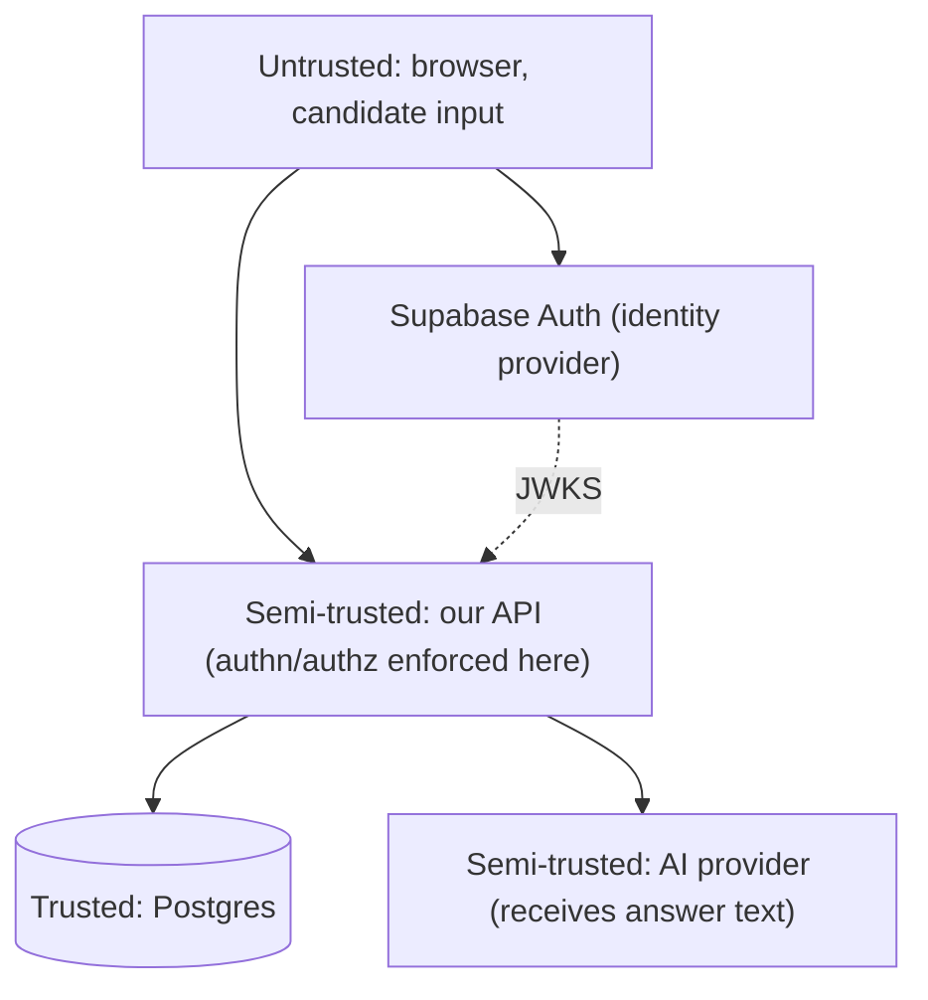

# 08 — Security, Privacy & Non-Functional Requirements

> Status: Draft for approval · Depends on: 04, 05, 06, 07

## 1. Reasoning

The system holds three things worth attacking: candidate identity and contact data,
candidate answers (personal, sometimes embarrassing, occasionally containing
employer-confidential detail), and the question bank with its rubrics (our
commercial asset). It also spends money per request on a third-party API, which
makes it a target for resource abuse.

Phase 0 security is therefore: correct authentication, airtight per-object
authorisation, strict input handling, bounded spend, and no secrets or personal data
in places they don't belong. Everything else (WAF, SIEM, pen-test programme, SOC 2)
is deliberately later — but nothing here should have to be *undone* to get there.

## 2. Trust boundaries

Key statement: **the API is the only trusted enforcement point.** The SPA enforces
nothing; Supabase authenticates but does not authorise; the database is not exposed
to clients. Every rule below is enforced server-side.

## 3. Authentication

- Supabase Auth issues the access token; the SPA never sees a password after submit
  and the API never handles passwords at all. This removes an entire class of risk
  (credential storage, reset flows, brute force) in Phase 0.
- **Token verification is asymmetric (JWKS/RS256 or ES256), not the shared HS256
  secret.** Reason: the HS256 project secret is a signing key — anything holding it
  can mint tokens for any user. With JWKS the backend holds only a public key.
  If the Supabase project predates asymmetric keys, migrating the project's JWT
  signing keys is a launch blocker, not a nice-to-have.
- Verification checks, all of them, every request: signature against a cached JWKS
  (refreshed on unknown `kid`, cached 10 min), `iss` matches our project URL, `aud`
  matches `authenticated`, `exp`/`nbf` with ≤ 60 s clock skew, and `sub` present.
- Sessions: short access token (1 h) + refresh token held by the Supabase JS client
  in the browser. Refresh is single-flight in the Axios interceptor.
- Email verification required before starting an interview (cheap abuse control);
  OAuth (Google) is treated as verified.
- Admin accounts additionally require MFA, enabled in Supabase. There is no
  self-service path to `ADMIN`.

**Deliberate acceptance:** the access token lives in browser memory + Supabase's
storage rather than an `HttpOnly` cookie. Cookies would require a same-site backend
and CSRF protection; token-in-header with a strict CSP and no third-party scripts is
the pragmatic Phase 0 choice. Revisit if we ever render user-generated HTML.

## 4. Authorisation

**Roles come from our `app.users` table, never from a JWT claim.** A claim is
attacker-adjacent (it depends on the IdP's metadata handling being perfect and on
nobody ever writing to `user_metadata` from the client). Our table is a single
authoritative fact we control.

Flow: verify JWT → look up `users` by `(auth_provider, auth_subject)` (cached 60 s,
invalidated on role change) → build `CurrentUser{userId, role, orgId, status}` →
authorise.

Two layers:

1. **Route-level** — `/api/v1/admin/**` requires `ADMIN`. One security rule, one
   integration test asserting `403` for every admin route with a candidate token.
2. **Object-level** — every interview/answer/report access checks
   `interview.candidate_user_id == currentUser.id` (or `ADMIN`). This lives in the
   application service, not the controller, so it cannot be bypassed by a new
   controller. A missing check is caught by a test convention: every candidate-facing
   service method taking an `interviewId` has a "wrong owner" test.

**IDOR posture:** unauthorised access to an existing object returns `404`, not `403`
(05 §2.8). UUIDv7 IDs are unguessable but never treated as a security control.

Suspended/deleted users are rejected at the authentication filter regardless of a
still-valid token.

## 5. Row-level security: a considered decision

We do **not** use Postgres RLS as the primary authorisation mechanism. The backend
connects as one role; expressing "a candidate may read their own interview" twice (in
Java and in SQL policies) doubles the surface for divergence, and RLS policies are
hard to unit-test and easy to get subtly wrong with the transaction-mode pooler.

However: **no client ever gets a Postgres connection.** The Supabase `anon` key is
used only for auth in the browser; the database is not exposed via PostgREST to
clients (Supabase's Data API is disabled for the `app` schema, and the `service_role`
key never reaches the browser). If we later expose any direct client data access,
RLS becomes mandatory before that ships. This is recorded as an explicit condition.

## 6. Input validation and injection

| Vector | Control |
|---|---|
| SQL injection | JPA/Spring Data parameter binding; no string-concatenated SQL; native queries reviewed and parameterised |
| Oversized payloads | `spring.servlet.multipart` limits; global request body cap 256 KB; answer text capped at 4000 chars server-side |
| JSON deserialisation | `FAIL_ON_UNKNOWN_PROPERTIES=true` on request DTOs; no polymorphic type handling; no `@JsonTypeInfo` |
| Mass assignment | Request DTOs are separate records; entities are never bound to request bodies |
| Path traversal | No file paths derived from user input in Phase 0 |
| SSRF | No user-supplied URLs are fetched. AI endpoints come from configuration only |
| XSS | React escapes by default; **no `dangerouslySetInnerHTML` anywhere** (ESLint-banned). Answers and AI output are rendered as text. Strict CSP (§10) |
| Header injection / log forging | Newlines stripped from any user value that reaches a log field; structured JSON logging makes forging ineffective |
| Enumeration | Uniform `404`; identical timing and response for unknown vs unauthorised |
| Regex DoS | No user-supplied regex; static patterns reviewed |

Validation lives in three places with distinct jobs (06 §9): DTO bean validation,
domain invariants, and application-level state validators.

## 7. Data privacy

**Data inventory**

| Category | Examples | Sensitivity |
|---|---|---|
| Identity | email, display name, `auth_subject` | Personal data |
| Profile | years of experience, target role | Personal data, low sensitivity |
| Answer content | free text written by the candidate | **Personal data, potentially confidential** — may contain employer details the candidate shouldn't share |
| Derived | scores, criterion verdicts, reports | Personal data, assessment outcome |
| Operational | trace ids, hashed IP, job rows | Pseudonymous |

**Principles applied**

- **Minimisation.** We do not collect date of birth, phone, address, gender,
  location, or CV. We do not need them and will not store them. No government IDs, no
  financial data, ever.
- **Prompts carry no identity.** The evaluation prompt contains the question, the
  rubric, the reference answer and the answer text — **no name, no email, no user
  id**. Correlation ids in `ai_invocations` stay on our side. This means a provider
  breach exposes anonymous answer text, not identified candidate records.
- **Provider data handling.** Only providers with a zero-retention / no-training
  configuration for API traffic are used, configured explicitly and recorded per
  provider in config. This is checked before adding any provider.
- **IPs are hashed** (`sha256(ip ‖ rotating_salt)`) wherever recorded; raw IPs are
  never persisted.
- **Retention** per 04 §7; `ai_invocations.raw_response` (which contains answer text)
  is nulled after 30 days.
- **Deletion.** `DELETE /api/v1/me` (Phase 0: an admin-executed request via support,
  a self-service endpoint in Phase 1) hard-deletes profile, drafts, answers, evidence
  and raw AI payloads; anonymises the `users` row; retains score aggregates without
  content. Completed within 30 days.
- **Export.** A candidate can download their reports (Phase 1: full JSON export).
- **Transparency.** The interview setup screen states plainly that answers are sent
  to a third-party AI provider for grading. Consent is informed, not buried.

The lawful-basis / DPA / privacy-policy work is a launch checklist item, not an
architecture item — but the architecture above is what makes those documents
truthful.

## 8. Secrets and configuration

- Every secret from the environment: `SUPABASE_PROJECT_URL`, `SUPABASE_JWKS_URL`,
  `DATABASE_URL`, `AI_PROVIDER_API_KEY`, `AI_FALLBACK_API_KEY`. Nothing in the repo,
  nothing in `application.yml`, `.env` files git-ignored, `.env.example` carries
  placeholder values only.
- Secret scanning (gitleaks) in CI and as a pre-commit hook; a hit fails the build.
- Key rotation: AI provider keys rotatable without a code change (env var + restart);
  documented runbook.
- The Supabase `service_role` key is **not used by the application at all** — the
  backend connects to Postgres with a dedicated database user that has DML rights on
  the `app` schema and nothing else (no superuser, no rights on `auth.*`). Flyway
  runs as a separate migration user with DDL rights.
- **Logging hygiene (hard rules):** never log JWTs, API keys, `DATABASE_URL`, email
  addresses, answer text, prompts, or model outputs. A logging test asserts that a
  representative answer string never appears in captured log output. AI payloads go
  to `ai_invocations.raw_response`, which is access-controlled and expires.

## 9. AI-specific security

### 9.1 Prompt injection

Candidate answers are hostile input that we deliberately feed to a model. Layered
defence:

1. **Channel separation.** Instructions are in the system/developer channel; the
   answer is a distinct, delimited user-content block (07 §3). Delimiter sequences
   are stripped from the answer before insertion.
2. **The model cannot emit free-form displayed text.** Output is a fixed JSON schema
   of enums, numbers, and short strings. In Phase 0 the model **cannot author the
   next question** (follow-ups are curated rows, 07 §9) — this removes the highest-
   impact injection outcome, which is making the platform display attacker text.
3. **The model cannot set the score.** Even a fully successful injection can at most
   move criterion verdicts on that one answer — it cannot bypass weights, the credit
   table, or the aggregation.
4. **Evidence verbatim check (G4).** An injected instruction cannot manufacture
   evidence that doesn't exist in the answer.
5. **Detection.** `injectionSuspected` is requested and stored; a suspected answer
   suppresses follow-ups and is surfaced to admin.
6. **Regression cases.** Five injection cases in the golden set that must never move
   a score (07 §11).

Residual risk accepted: a sophisticated injection could make one answer score higher
than it deserves. Blast radius is one candidate's own mock interview score — not
other users' data, not money, not the question bank. That is a proportionate
acceptance for Phase 0, and it changes if we ever sell this for real hiring
decisions, where human review of high-stakes results becomes a requirement.

### 9.2 Other AI risks

| Risk | Control |
|---|---|
| Prompt/rubric extraction ("repeat your instructions") | Output schema has no free-text field long enough to carry the rubric; explicit refusal rule; `maxLength` on every string; question bank is our IP |
| Model output as an injection vector into our UI | Rendered as text, never HTML; length-capped |
| Cost abuse (spamming answers) | Rate limits (05 §2.9), per-user daily cost cap, one-live-attempt constraint, email verification gate |
| Provider account compromise | Separate keys per environment; least-privilege where the provider supports it; spend alerts |
| Training on candidate data | Zero-retention/no-training configuration required per provider |

## 10. Web hardening

- HTTPS everywhere, HSTS (`max-age=31536000; includeSubDomains; preload`).
- CSP: `default-src 'self'; script-src 'self'; style-src 'self' 'unsafe-inline'
  (Emotion); img-src 'self' data:; connect-src 'self' <supabase-url>;
  frame-ancestors 'none'; base-uri 'self'; object-src 'none'`.
- `X-Content-Type-Options: nosniff`, `Referrer-Policy: strict-origin-when-cross-origin`,
  `Permissions-Policy` denying camera/microphone/geolocation (revisited for voice),
  `X-Frame-Options: DENY`.
- CORS: exact allow-list from config, never `*` (05 §5.2).
- No cookies in Phase 0 → no CSRF surface. If cookies are ever introduced, CSRF
  tokens become mandatory in the same change.

## 11. Rate limiting and abuse

Bucket4j with an in-memory store in Phase 0 (single instance; the limits are abuse
control, not billing). Keyed by user id where authenticated, hashed IP otherwise.
Limits in 05 §2.9. When we run more than one instance, the store moves to Postgres or
Redis — a one-class change, and the limits are already expressed as configuration.

Additional abuse controls: email verification before starting an interview, one live
attempt per candidate (a DB constraint), per-user daily AI cost cap, and a simple
signup-per-IP-per-hour limit.

## 12. Auditability

`app.audit_log` (04 §3.8) records every admin action and every security-relevant
event: question/template publish and archive, re-evaluation, report regeneration,
role change, user suspension, attempt force-abandon, failed authorisation attempts
(aggregated). Entries carry actor, action, entity, before/after state, hashed IP and
trace id.

Candidate-facing auditability is different and equally important: the append-only
`evaluations` chain plus pinned `question_version_id` means we can always answer
"why did I get this score, and has it changed?" with evidence.

## 13. Observability of security events

Metrics/alerts in Phase 0 (kept few, so they get looked at):

| Signal | Alert threshold |
|---|---|
| 401 rate spike | > 10× baseline for 5 min |
| 403 on admin routes | any, from a non-admin user |
| Failed authorisation (ownership) | > 5 per user per hour |
| `injectionSuspected` | > 2% of evaluations in a day |
| AI spend | > 150% of daily budget |
| Dead jobs | > 0 for 30 min |
| Evidence rejection rate (G4) | > 5% of evaluations |

## 14. Other non-functional requirements

| NFR | Phase 0 target | How |
|---|---|---|
| Availability | 99% (best-effort, single instance) | Managed platform, health checks, graceful shutdown draining in-flight jobs |
| API latency | p95 < 300 ms for non-AI endpoints | Indexed reads, no N+1 (verified by a query-count test on the state and result endpoints), no AI on the request path |
| Evaluation latency | p95 < 12 s | Async worker, bounded concurrency, per-purpose models |
| Durability | RPO ≤ 24 h, RTO ≤ 4 h | Supabase daily backups + PITR where the plan allows; **a restore is rehearsed once before launch** — an untested backup is not a backup |
| Data integrity | No lost answers | Answer written before evaluation is enqueued, in one transaction |
| Scalability | 100 concurrent interviews | Stateless app, bounded pools; the constraint is AI throughput, not the app |
| Testability | See 06 §12 | Clock injection, pure policies, mock AI adapter, Testcontainers |
| Accessibility | WCAG 2.1 AA | 03 §2.7, axe checks in CI |
| Portability | Leave Supabase within one sprint if needed | No `auth.*` FKs, own schema, JWKS-based verification, standard Postgres |

## 15. Assumptions

- Single region; no data-residency commitments made to anyone in Phase 0.
- No enterprise SSO, SCIM, or contractual security requirements yet (they arrive with
  institutes — identity is isolated for exactly this reason).
- No payment data, ever, in Phase 0.
- We are the only administrators.

## 16. Risks

| Risk | Sev | Mitigation / acceptance |
|---|---|---|
| Missing ownership check on a new endpoint | High | Authorisation in the service layer + mandatory wrong-owner test per method + code review checklist |
| JWT verification misconfigured (e.g. `aud` unchecked) | High | Explicit test asserting rejection of: wrong issuer, wrong audience, expired, tampered signature, `alg: none` |
| Prompt injection | High | §9.1 layered defence; blast radius accepted and bounded |
| Secret leaked into the repo | High | gitleaks in CI + pre-commit; key rotation runbook |
| Answer content leaked in logs | Med | Explicit logging rules + a test that asserts absence |
| Supabase compromise | Med | JWKS (no shared signing secret held by us), least-privilege DB user, no `service_role` key in the app |
| Backup never tested | Med | Rehearsed restore is a launch checklist item |
| Single-instance rate limiter bypassed by scaling out | Med | Documented condition: moving to >1 instance requires the shared-store change in the same release |
| Admin account compromise | Med | MFA required, no self-service role escalation, all admin actions audited |
