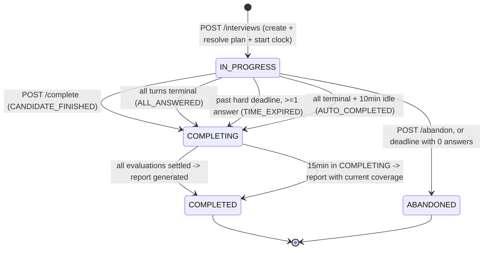

# 10 — Pre-Development Architecture Review

> Status: **Authoritative.** Where this document conflicts with 01–09, this document
> wins. Docs 01–09 are updated during M0/M1 to match.
> Reviewer stance: adversarial review of my own design, before any code exists.

## 0. The single principle that drove most of the cuts

I justified several Phase 0 structures as "cheap seams for the future". Re-examined,
most were not seams at all:

> **`ALTER TABLE ... ADD COLUMN <nullable>` is free in Postgres 11+ (no table
> rewrite). Therefore a nullable column is never a seam worth pre-building.**
>
> The seams that genuinely matter are **structural**: primary keys, unique
> constraints, table decomposition, the direction of dependencies, and the shape of
> the state machine. Those are expensive to change once real data exists.

Applying that test consistently kills the `organizations` table, the voice media
columns, and several other "future-proofing" additions, while *strengthening* the
seams that actually matter (turn-based interview model, immutable content versions,
provider port, criterion-level results).

Second principle applied throughout:

> **Prefer natural keys and database constraints over frameworks.** Every place I had
> built idempotency machinery, there was already a natural uniqueness constraint doing
> the job.

Net effect: **23 tables → 18** (see docs/database.md; `audit_log` was removed in the final schema review), **6 interview states → 4**, **~30 endpoints → 22**,
and three subsystems deleted outright (idempotency keys, domain events, circuit
breaker/failover), with no loss of Phase 0 capability.

---

# PART A — Review by area

## A1. Product scope

**Verdict: sound, with one feature that should change shape.**

Problems found:

| # | Problem | Resolution |
|---|---|---|
| 1 | **Immediate follow-up questions are the single largest source of complexity in the whole design.** They force: evaluation to be on the interview's critical path, `advance` to return `202 PENDING`, client polling *during* the interview, a 10 s decision budget, a stall-fallback rule, and timing rules inside `FollowUpPolicy`. That is four moving parts for one feature | **Change to deferred follow-ups** (D-1 below). Same product capability, none of the machinery |
| 2 | `passing_score` / `passed` on templates and reports | **Removed.** A mock interview does not pass or fail; bands communicate more and mislead less |
| 3 | 8 skills at launch × 15 questions = 120 questions is a content mountain hidden inside a "scope" line | **Reduced launch bank to 3 skills (Java, Spring Boot, SQL) × 15 = 45 questions and 2 templates.** React/Angular/REST/Microservices/System Design are *data*, added post-launch without code. This is the largest schedule risk in the plan and the cheapest to fix |
| 4 | Landing page listed as a Phase 0 build item alongside the platform | Keep, but it is one static route. Explicitly not a marketing site |
| 5 | Success metric "criterion agreement ≥ 80%" with no baseline | Added: measure human-to-human agreement on 10 cases first. If two experts only agree 85% of the time, an 80% target for the model is near-ceiling, and we would otherwise chase an impossible number |

**D-1 — Deferred follow-ups (needs your acknowledgement, changes the brief).**

Instead of: answer → wait for evaluation → maybe ask a follow-up → next question,

do: ask all core questions back-to-back with **zero waiting**; evaluations complete in
the background while the candidate works; **after the last core question**, the engine
appends up to N follow-ups targeting the weakest criteria across the whole interview.

Why this is better, not just simpler:
- By the time the last core question is answered (~12 min in), every evaluation
  finished minutes ago. **No candidate ever waits on the AI.** The stall risk is gone
  structurally, not mitigated.
- Follow-ups target the *globally* weakest criteria instead of whatever happened to
  be question 3 — better use of a small follow-up budget.
- Deletes: `202 PENDING` from the contract, mid-interview polling, the decision
  budget, the stall fallback, and all timing rules in the follow-up policy.

What we lose: conversational immediacy. Phase 0 is typed text — it is not
conversational anyway. Immediacy matters in **voice**, where the model is already in
the loop and TTS masks latency; that is the right place to reintroduce it.

## A2. User flows

**Verdict: mostly good; two real gaps and one over-specified flow.**

| # | Finding | Resolution |
|---|---|---|
| 1 | **Gap: no bootstrap path for the first admin.** Nothing in the design creates an `ADMIN`. I would have discovered this at M6 | Added `APP_BOOTSTRAP_ADMIN_EMAILS` env var: on JIT provisioning, an email on that list is provisioned as `ADMIN`. No self-service escalation, no SQL by hand |
| 2 | **Gap: `COMPLETING` can hang forever.** E8 said "the candidate sees a banner" but defined no transition. If the provider is down for a day, the attempt sits in `COMPLETING` indefinitely | Added rule: `COMPLETING` for > 15 min → generate the report with whatever coverage exists. Combined with the "no result at all" case (A5 #12) |
| 3 | **Gap: candidate answers everything then closes the tab.** Nothing completes the attempt | Added rule: all turns terminal + 10 min inactivity → auto-complete (`AUTO_COMPLETED`) |
| 4 | Two abandonment rules (48 h inactivity *and* a 45 min hard cap) that overlap confusingly | **Dropped the 48 h rule.** The hard deadline handles everything: past deadline with ≥1 answer → complete; with 0 answers → abandon |
| 5 | Server-side answer drafts (`PUT …/draft` + table) | **Removed.** localStorage covers refresh and browser crash — the actual failure modes in an 18-minute session. Device-switch mid-interview is not a Phase 0 scenario. Saves a table, an endpoint, a rate-limit bucket and a debounce loop |
| 6 | Separate skip endpoint | **Merged** into `POST /answers` with `"skipped": true`. One code path for turn termination |
| 7 | `CREATED` → `start` as two round trips behind one button click | **Collapsed.** One `POST /interviews` creates, resolves the plan, starts the clock, returns state. The setup screen reads the *template*, which it already had |
| 8 | Two-tab behaviour specified as "returns the first answer with `duplicate: true`" | Kept, but now it falls out of the `uq_answers_turn` constraint rather than a client-generated id (A12) |

## A3. Backend module boundaries

**Verdict: one module too many, one module too large, one mechanism redundant.**

| # | Finding | Resolution |
|---|---|---|
| 1 | `catalog` and `template` are both "authored content", reference each other constantly, and share one lifecycle idiom (draft → published → immutable) | **Merged `template` into `catalog`.** 9 modules → 8. Removes the chattiest internal boundary in the design |
| 2 | `admin` module depended on every other module's `api` — a module that depends on everything is a coupling magnet | **Shrunk.** Admin *content* controllers move into the module that owns the data (`catalog/api/QuestionAdminController`). The `admin` module keeps only the cross-cutting overview and the jobs view |
| 3 | **Two async mechanisms**: Spring domain events *and* the job queue. Events were used to "nudge the worker", which polls anyway | **Deleted `shared/events` entirely.** One mechanism: published interfaces for synchronous reads, job rows for asynchronous work. This was pure ceremony |
| 4 | `identity` vs the brief's `candidate` module | Confirmed merged: `identity` owns users, roles and profiles. A separate `candidate` module would own one table and no behaviour |
| 5 | Layer rule "`api → application → domain`, infrastructure implements ports" applied uniformly | Confirmed the *exception* explicitly: Spring Data repository interfaces live in `infrastructure` and are called from `application` with **no hand-written port interface**. Ports exist only across volatility boundaries: `AiClient`, `TokenVerifier`, `Clock`, `IdGenerator`. Four ports, not forty |

Final modules: `shared`, `identity`, `catalog`, `interview`, `evaluation`,
`reporting`, `ai`, `admin`.

Retained and confirmed valuable: **`evaluation` does not depend on `interview`.** It
takes (answer text, question version, rubric) and returns verdicts. That is what makes
the admin dry-run tool free and the engine independently testable.

## A4. Frontend module boundaries

**Verdict: the structure is right; the component inventory is over-built.**

| # | Finding | Resolution |
|---|---|---|
| 1 | 26 design-system components specified before a single feature exists — and I wrote the rule "a wrapper that only re-exports MUI is deleted" and then violated it with `Badge`, `Chip`, `Tabs`, `Progress`, `Toast`, `Select` | **Cut to 9 pre-built components**: `Button` (loading state), `TextInput`, `TextArea`, `Card`, `Dialog`, `EmptyState`, `QueryBoundary`, `DataTable`, `PageHeader`. Everything else uses MUI directly with theme defaults until a second consumer appears |
| 2 | Product patterns are where the real value is, and they were buried in a list of 13 | **Kept 4, all product-specific**: `InterviewProgress`, `ScoreCard`, `SkillScoreBar`, `RubricResultList` (with evidence highlighting). These encode domain knowledge MUI cannot |
| 3 | `features/history` as its own feature for one table | **Merged into `features/results`** |
| 4 | Zod validation of *every* API response in production | **Narrowed to two shapes**: interview state and report. Those are the ones where a malformed payload must fail loudly instead of `undefined.map` |
| 5 | Hand-written Zod mirrors of the whole API = guaranteed drift | Accepted for Phase 0 with the narrowing above; codegen from OpenAPI is a Phase 1 half-day |
| 6 | `usePolling` used in the runner | **No longer needed in the runner** (D-1). Polling survives only on the result page |

Confirmed: TanStack Query owns all server state; Context holds session + theme only;
`eslint-plugin-boundaries` forbids feature→feature imports.

## A5. PostgreSQL schema

See **PART B** for the table-by-table review. Headline findings:

| # | Finding | Resolution |
|---|---|---|
| 1 | `organizations` + 4 nullable `organization_id` columns justified as a cheap seam | **Removed.** Per §0, nullable columns are free to add later. What was actually being pre-built was a *concept* with no behaviour |
| 2 | `follow_up_prompts` as a table, one row per criterion probe | **Merged into `rubric_criteria.follow_up_prompt`.** Authoring the criterion and its probe in one form is also better UX |
| 3 | `answer_drafts` | **Removed** (A2 #5) |
| 4 | `idempotency_keys` + `Idempotency-Key` header | **Removed** (A12) |
| 5 | `answers.client_submission_id` | **Removed.** `uq_answers_turn` already makes one-answer-per-turn a database fact |
| 6 | `COMPLETED_PARTIAL` as a status forced every query to handle two terminal "done" values | **Merged into `COMPLETED`** + report coverage columns |
| 7 | `interviews.attempt_number` + a unique constraint on it — a `MAX+1` race and a constraint that can only cause outages | **Removed**, derived with `ROW_NUMBER()` for display |
| 8 | `interviews.core_question_count` / `max_follow_ups_total` denormalised from an already-immutable template version | **Removed.** Join the pinned template version |
| 9 | `answers.char_count` | **Removed.** `length(content_text)` is free |
| 10 | `time_spent_sec` on `answers` meant skipped turns lost their timing | **Moved to `interview_questions`** — it is a property of the turn, not of the answer. Skips now create **no answer row** |
| 11 | `audit_log` with `before_state`/`after_state` jsonb, for a system with one admin | **Kept, slimmed**: actor, action, entity, metadata, timestamp. Dropped before/after diffs. Justification for keeping anything at all: it is the only fact that cannot be reconstructed later |
| 12 | **Gap: `interview_reports.overall_score NOT NULL` makes the "every evaluation failed" case unrepresentable** | Added: coverage 0 → no report row; interview completes with `final_score = NULL`; `GET /result` returns `status: NOT_SCORED`. A real hole |
| 13 | Voice seam columns `media_uri`, `transcript_confidence` | **Removed** for consistency with §0. Kept `input_mode` only, because the API contract needs the enum to have a home |

## A6. API contracts

See **PART F**. Headline findings:

| # | Finding | Resolution |
|---|---|---|
| 1 | `GET /interviews/{id}` is redundant next to `/state` and `/result` | **Removed** — the brief proposed it; it should not exist yet |
| 2 | `POST /interviews/{id}/start` | **Removed**, folded into create |
| 3 | `202 PENDING` on `advance` | **Removed** (D-1). `advance` always returns `200` with state |
| 4 | Cursor pagination with opaque base64 cursors | **Downgraded to offset pagination** (`?page=&size=`) via Spring Data `Pageable`. Cursors are correct at scale and unnecessary below ~10k rows |
| 5 | `ETag`/`If-Match` optimistic concurrency on admin writes, for one admin | **Removed.** Reinstate when a second admin exists |
| 6 | OpenAPI diff gate in CI, for an API whose only consumer is in the same repo and typechecked | **Removed as a gate**; springdoc kept for browsing |
| 7 | `GET /meta/version` | **Removed**, folded into readiness |
| 8 | `POST /admin/interviews/{id}/regenerate-report` | **Removed** — re-evaluation already triggers regeneration |
| 9 | `POST /admin/skills` | **Removed** — skills are seeded by migration in Phase 0 |
| 10 | `GET /admin/ai-usage` | **Removed** — the two numbers that matter fold into `/admin/overview` |
| 11 | 7 rate-limit buckets | **Reduced to 3** |
| 12 | 16 error codes | **Reduced to 11** |

## A7. Authentication / authorization

**Verdict: strongest part of the package. Two additions, one clarification.**

Confirmed correct and non-negotiable: JWKS asymmetric verification (never the HS256
project secret); roles from `app.users`, never from a JWT claim; ownership checks in
the service layer; `404` not `403` for cross-user access; admin path separation.

| # | Finding | Resolution |
|---|---|---|
| 1 | No first-admin bootstrap (A2 #1) | `APP_BOOTSTRAP_ADMIN_EMAILS` |
| 2 | 60 s role cache means a suspension takes up to a minute to bite | Accepted and documented. Explicit cache invalidation on role/status change in the same transaction; the 60 s is only a failure-mode ceiling |
| 3 | "Email verification required before starting an interview" was stated but not placed | It is a precondition check inside `POST /interviews`, returning `403 EMAIL_NOT_VERIFIED` |
| 4 | RLS decision | Confirmed: not load-bearing, with the recorded hard condition — **if any direct client-to-Postgres access is ever enabled, RLS ships in the same release.** Supabase Data API stays disabled for the `app` schema |

## A8. AI provider abstraction

**Verdict: the port is right; the resilience machinery around it was over-engineered.**

| # | Finding | Resolution |
|---|---|---|
| 1 | **Circuit breaker (Resilience4j) + automatic failover to a secondary provider.** This builds machinery for a failure whose blast radius the job queue already absorbs — a provider outage means jobs drain later, and nobody is blocked | **Removed both.** Timeouts + bounded retries with backoff only. One real adapter + `MockAdapter`. Adding a second adapter later is a day's work *because the port exists* — which was always the point |
| 2 | 4 `AiPurpose` values (`ANSWER_EVALUATION`, `FOLLOW_UP_SELECTION`, `REPORT_SUMMARY`, `TRIAGE`) for 2 actual calls | **Reduced to 2.** Follow-up selection is now deterministic; triage does not exist |
| 3 | `request_fingerprint` described as a cache key we never read | Kept as a column (duplicate detection, golden-set comparison), dropped the cache claim |
| 4 | Per-purpose model routing via config | Kept — it is 2 config keys and it is how a model swap stays a config change |

Confirmed and reinforced: **model ids pinned exactly, never `-latest`**; provider SDK
types confined to `ai/infrastructure`; every call writes an `ai_invocations` row;
`temperature 0`; only `evaluation` and `reporting` may reference `AiClient` (ArchUnit).

## A9. AI evaluation architecture

**Verdict: the core is right. I introduced one piece of unexplainable math that
contradicts the product thesis.**

| # | Finding | Resolution |
|---|---|---|
| 1 | **Confidence-weighted credit shrinkage** (`credit' = 0.5 + (credit − 0.5) × confidence/0.5`). This makes a score impossible to explain to a candidate — "why is this criterion worth 0.73?" — in a product whose entire thesis is explainability. It also leans on self-reported LLM confidence, which is poorly calibrated | **Removed.** Credit is exactly `MET 1.0 / PARTIAL 0.5 / MISSING 0.0 / CONTRADICTED −0.25`. Confidence is stored and used for two things only: gating follow-ups, and admin quality signals |
| 2 | Golden set of 60–100 hand-labelled cases at launch | **Reduced to 40** (5 questions × 8 answers), harness built to grow. Includes the 5 injection cases and the confidently-wrong cases — those are non-negotiable |
| 3 | No human baseline for the agreement target | Added: label 10 cases twice, independently, to establish the human ceiling before judging the model against 80% |
| 4 | Evaluation rows written for interim retry failures would collide with `uq_eval_one_current` | Clarified: **an `evaluations` row is written only on a terminal outcome.** Interim failures live in `ai_invocations` and `jobs.last_error` |
| 5 | `PER_CRITERION` fallback mode described as "designed in" | Kept as a documented option, explicitly **not** implemented. One config branch, zero Phase 0 code |

Confirmed as the load-bearing decisions: rubric criteria as relational rows; the
verbatim-evidence gate (G4) with automatic verdict downgrade; `CONTRADICTED` distinct
from `MISSING`; the model never authors displayed text; the backend computes every
score.

## A10. Interview state management

**Verdict: over-modelled by two states; the turn model is right.**

See **PART C**. Six interview states → four. `EXPIRED`, `AUTO_COMPLETED` and
`TIME_EXPIRED` are **reasons, not states** — they became a `completion_reason`
column. `CREATED` collapsed into `IN_PROGRESS`. `COMPLETED_PARTIAL` collapsed into
`COMPLETED` + coverage.

Confirmed correct and worth defending: the interview is a **row set in Postgres**, the
client learns it from exactly one endpoint, and progression is an explicit server
operation. That property is what makes refresh-safety, two-tab safety, and the future
voice mode fall out for free rather than being separately engineered.

## A11. Error handling

**Verdict: correct approach, too many codes, one missing case.**

- Error codes 16 → 11 (PART F §F.4).
- `410 GONE` for expiry removed — an expired interview is a `409 CONFLICT` on the
  state machine like any other wrong-state transition. One rule, not two.
- **Missing case added:** `GET /result` when coverage is 0 → `200` with
  `status: NOT_SCORED` and an explanation, not a 404 and not a fake 0.0 score.
- Confirmed: `ProblemDetail` (native in Spring Boot 3), one `@RestControllerAdvice`,
  stable `code` field, `traceId` echoed, no try/catch in controllers.

## A12. Idempotency

**Verdict: I built a framework where three natural keys already existed. Deleted.**

| Operation | I had proposed | Actual protection | Verdict |
|---|---|---|---|
| Create interview | `Idempotency-Key` header + `idempotency_keys` table | `uq_interviews_one_live` partial unique index | **Make the endpoint idempotent by design**: if a live attempt exists for the same template, return `200` with it. Different template → `409` naming the live attempt |
| Submit answer | `clientSubmissionId` in the body + a compound unique constraint | `uq_answers_turn UNIQUE (interview_question_id)` | **The turn *is* the key.** Second submit returns `200` with the stored answer and `duplicate: true` |
| Complete interview | `Idempotency-Key` header | State machine — `COMPLETING`/`COMPLETED` are absorbing | Naturally idempotent |
| Enqueue a job | — | `uq_jobs_dedupe UNIQUE (dedupe_key)` | Naturally idempotent |
| Advance | — | Derived from turn statuses, not a counter | Naturally idempotent |

**Removed: the `idempotency_keys` table, the `Idempotency-Key` header, and
`client_submission_id`.** A generic idempotency framework earns its place when POSTs
appear that have no natural key — payments being the obvious future case. It is a
Phase 1 addition with a clear trigger.

One consequence accepted: after submitting, a candidate cannot revise. That matches
real interviews and is safer than an overwrite path.

## A13. Logging / observability

**Verdict: right instincts, too many metrics to actually watch.**

- Metrics 12 → **7**: `interview.completed`, `evaluation.latency`,
  `evaluation.failed{reason}`, `ai.cost.micros`, `ai.evidence_rejected`,
  `job.queue.oldest_age`, `http.server.requests`.
- Alerts 7 → **4**: dead jobs > 0 for 30 min; AI spend > 150% of daily budget;
  evidence-rejection rate > 5%; oldest queued job > 10 min.
- **Distributed tracing (OTel) downgraded**: one process, one database. `traceId` in
  MDC and in every problem response gives us request correlation, which is the actual
  need. Full tracing arrives with the first out-of-process split.
- Confirmed non-negotiable: JSON structured logs; **never log answer text, prompts,
  model output, emails, tokens or `DATABASE_URL`**, with a test asserting a
  representative answer string never appears in captured output.

## A14. Security

**Verdict: proportionate. Two items were security theatre for Phase 0, one gap.**

| # | Finding | Resolution |
|---|---|---|
| 1 | Gap: first-admin bootstrap (A2 #1) | Fixed |
| 2 | Hashed-IP recording in `audit_log` and rate limiting | Kept — genuinely cheap, and raw IPs are a liability |
| 3 | 30-day nulling of `ai_invocations.raw_response` | Kept — it holds answer text. It is one line in the maintenance job |
| 4 | Self-service account deletion endpoint | **Deferred**, admin-executed via support in Phase 0. Documented in the privacy policy as a 30-day manual process. Reinstate as self-service in Phase 1 |
| 5 | Prompt-injection residual risk | Re-affirmed with the blast radius restated: worst case is one candidate inflating *their own* mock score. It is bounded because the model cannot author displayed text, cannot set the score, and cannot manufacture evidence. This acceptance **changes the moment a company makes a hiring decision from a report** — recorded as the condition |
| 6 | Backup restore rehearsal | Kept as a launch blocker. An untested backup is not a backup |

## A15. Testing strategy

**Verdict: right shape, one gate too expensive, one gate missing.**

| # | Finding | Resolution |
|---|---|---|
| 1 | OpenAPI diff gate in CI | **Removed** (A6 #6) |
| 2 | axe accessibility checks in the component test suite | **Reduced** to one axe pass per layout during M10, not per component per build |
| 3 | Playwright E2E | **Kept at exactly one test**: signup → interview → report, against a seeded backend with `MockAdapter`. That single test is worth more than the rest of the frontend suite |
| 4 | **Missing gate: a query-count assertion** on `/state` and `/result`. These are the two endpoints where an N+1 would be invisible in dev and fatal in production | Added |
| 5 | Missing: adapter conformance suite framed as multi-provider | Reframed — with one adapter it is 5 WireMock tests: timeout, 429, 5xx, malformed body, schema-invalid body |

Confirmed: Testcontainers, never H2. Injected `Clock`. `ScoreCalculator` and
`FollowUpSelector` as pure functions with table-driven tests. ArchUnit rules present
from M0, before there is anything to violate them.

## A16. Future voice-interview support

**Verdict: better positioned than I claimed, for different reasons than I claimed.**

The columns I called the voice seam (`media_uri`, `transcript_confidence`) were the
*least* valuable part and are removed. What actually makes voice cheap is structural
and stays:

1. The interview is an ordered set of **turns**, not a form with fields.
2. Answers are consumed as **normalised text**; the evaluation engine has no idea how
   the text was produced.
3. **Progression is a server operation** (`advance`) — which is exactly the "I have
   finished speaking" trigger.
4. Server-owned state means a dropped connection mid-utterance is recoverable.

What voice will genuinely need, and is honest to list as new work: an ASR port beside
`AiClient`, a media upload endpoint, `evidence_start/end` recomputed against the
transcript (never assumed stable), a `VOICE` runner UI, and **the return of immediate
follow-ups** (D-1), which is natural there because the model is already in the loop.

## A17. Future institute/college support

**Verdict: I pre-built the wrong thing.**

`organizations` + nullable FKs is removed. When institutes arrive, the work is:
`organizations` and `memberships` tables, a nullable `organization_id` backfilled to
NULL (free), one query-scoping chokepoint, an assignment concept, and institute
reporting. **The nullable columns were never the expensive part** — the scoping and
the assignment model are, and neither can be usefully pre-built without knowing the
requirements.

What genuinely helps, and is already true: skills/templates/rubrics are data not code;
identity is isolated behind one module (an institute demanding SAML hits one module);
templates already have a draft→published lifecycle a content lead can use.

One structural check performed: does any Phase 0 unique constraint block tenancy
later? `uq_users_email` — one platform account per email, which stays correct under
multi-tenancy. `uq_tpl_key_version` — template keys become org-scoped later, which is
a constraint change on a small table. Both acceptable.

## A18. Future company/recruiter support

**Verdict: correctly excluded, and one real constraint surfaced.**

Nothing is pre-built, correctly. The surfaced constraint is not technical:

> The moment a company makes a hiring decision from a report, the prompt-injection
> acceptance in A14 #5, the "no proctoring" non-goal, and the absence of human review
> all become inadequate. Recruiter support is therefore gated on an **assessment
> validity** work item (human review of high-stakes results, injection hardening,
> identity assurance), not on schema changes.

Recording that now prevents the far more expensive mistake of selling screening on a
Phase 0 foundation.

---

# PART B — Table-by-table database review

Removed: `organizations`, `follow_up_prompts` (merged), `answer_drafts`,
`idempotency_keys`, and — in the final schema review — `audit_log`. **18 tables.** Common to all: `id uuid` PK generated as UUIDv7 in
the application; `created_at timestamptz NOT NULL DEFAULT now()`; `updated_at` only on
tables that are actually mutated. Enums are `text` + `CHECK` throughout (04 D11).

### B1. `users`
- **Why:** authoritative identity and role inside our system, decoupled from the IdP.
- **PK:** `id`. **FKs:** none (deliberately — no FK into `auth.*`).
- **Unique:** `(auth_provider, auth_subject)`; `email`.
- **Indexes:** the two uniques suffice; hot path is the auth lookup by subject.
- **Relations:** 1:1 `profiles`; 1:N `interviews`.
- **Nullable:** `display_name`, `last_seen_at`. Not `email`, `role`, `status`.
- **Enums:** `role` (CANDIDATE, ADMIN), `status` (ACTIVE, SUSPENDED, DELETED).
- **Timestamps:** created, updated, last_seen.
- **Versioning:** none. **JSON:** none.
- **Verdict: keep.** Removed `organization_id`.

### B2. `profiles`
- **Why:** candidate-supplied data, separated from identity so account deletion
  hard-deletes this row while anonymising `users`, and so the auth hot-path row stays
  narrow.
- **PK:** `user_id` (shared PK — enforces 1:1 structurally, no second surrogate id).
- **FK:** `user_id → users(id) ON DELETE CASCADE`.
- **Unique/Indexes:** PK only.
- **Nullable:** everything except `user_id`. This is optional data by design.
- **Enums:** none. **JSON:** `preferences jsonb` — **justified** (small, never queried).
- **Verdict: keep separate.** The deletion asymmetry is the reason.

### B3. `skills`
- **Why:** the taxonomy scores are grouped by; data, not a code enum, so new domains
  need no deploy.
- **PK:** `id`. **Unique:** `code`. **Indexes:** `code`; `(status, sort_order)` for lists.
- **Relations:** 1:N `questions`; M:N with templates via `template_skills`.
- **Nullable:** `description`. **Enums:** `status`, `category`.
- **Versioning:** none needed — a skill's identity does not change.
- **Verdict: keep.** Seeded by migration.

### B4. `questions`
- **Why:** the stable *identity* of a question across content revisions.
- **PK:** `id`. **Unique:** `question_key` (human-stable, makes seeding idempotent).
- **FKs:** `primary_skill_id → skills`, `created_by → users`.
- **Indexes:** `(primary_skill_id, difficulty, status)` — the pool-selection query.
- **Relations:** 1:N `question_versions`; N:1 `skills`.
- **Nullable:** `created_by`. **Enums:** `question_type`, `difficulty`, `status`.
- **Versioning:** this table *is* half of the versioning scheme.
- **Verdict: keep.** Removed `organization_id`. Kept `status` at family level
  (archiving a family is one write instead of one per version).

### B5. `question_versions`
- **Why:** immutable content. The single most important table for score comparability.
- **PK:** `id`. **FK:** `question_id → questions ON DELETE CASCADE`.
- **Unique:** `(question_id, version)`; **partial unique `(question_id) WHERE status='PUBLISHED'`** — at most one published version per family, as a database fact.
- **Indexes:** the uniques.
- **Relations:** 1:N `rubric_criteria`; 1:N `interview_questions` (pinned).
- **Nullable:** `context_text`, `published_at` (with `CHECK (status<>'PUBLISHED' OR published_at IS NOT NULL)`).
- **Enums:** `status` (DRAFT, PUBLISHED, ARCHIVED).
- **JSON:** none. **Versioning:** yes — the point of the table.
- **Verdict: keep, unchanged.** This survives review intact.

### B6. `rubric_criteria`
- **Why:** the criteria the model judges and the backend scores. Relational because we
  will ask "which concept do candidates miss most?".
- **PK:** `id`. **FK:** `question_version_id → question_versions ON DELETE CASCADE`.
- **Unique:** `(question_version_id, code)`. **Index:** `(question_version_id, sort_order)`.
- **Relations:** N:1 version; 1:N `evaluation_criterion_results`.
- **Nullable:** `follow_up_prompt` (new, absorbed from the deleted table), `comment`-like fields none.
- **Enums:** `tier` (CORE, DEPTH, BONUS).
- **Versioning:** inherited from the parent version — a rubric change *is* a content change.
- **Invariant:** `SUM(weight_bp) = 10000` per version, enforced at publish.
- **Verdict: keep, absorbed `follow_up_prompts`.**

### B7. `interview_templates`
- **Why:** authored definition of an interview, versioned like questions.
- **PK:** `id`. **Unique:** `(template_key, version)`; **partial unique `(template_key) WHERE status='PUBLISHED'`**.
- **FK:** `created_by → users`. **Index:** `(status, level)` for browsing.
- **Relations:** 1:N `template_skills`, `template_question_slots`, `interviews`.
- **Nullable:** `summary`, `description`, `published_at`.
- **Enums:** `level`, `status`.
- **Config columns kept flat, not JSON:** `core_question_count`,
  `max_follow_ups_total`, `target_duration_min`, `hard_duration_min` — all queried,
  validated and displayed.
- **Removed:** `visibility`, `organization_id`, `passing_score`, `max_follow_ups_per_topic`
  (with deferred follow-ups, only the total budget is meaningful).
- **Verdict: keep, slimmed.**

### B8. `template_skills`
- **Why:** the M:N join carrying the **weight** that makes the overall score meaningful.
- **PK:** composite `(template_id, skill_id)` — no surrogate key needed.
- **FKs:** both sides. **Invariant:** `SUM(weight_bp) = 10000`.
- **Timestamps:** none needed (child of an immutable parent).
- **Verdict: keep.** Textbook M:N-with-attribute.

### B9. `template_question_slots`
- **Why:** the ordered plan. `selection_mode` unifies "pin this question" and "pick one
  from this pool" in one ordered list.
- **PK:** `id`. **FKs:** `template_id`, `question_id` (nullable), `skill_id` (nullable).
- **Unique:** `(template_id, position)`.
- **Nullable by design:** `question_id` XOR `skill_id`, enforced by a `CHECK` on `selection_mode`.
- **Verdict: keep.** Considered splitting into pinned/pool tables and rejected: one
  ordered plan is easier to render, validate and reason about.

### B10. `interviews`
- **Why:** one candidate's attempt. The historical record.
- **PK:** `id`. **FKs:** `candidate_user_id → users`, `template_id → interview_templates` (a *version* row).
- **Unique:** **partial unique `(candidate_user_id) WHERE status IN ('IN_PROGRESS','COMPLETING')`** — one live attempt, as a database fact.
- **Indexes:** `(candidate_user_id, created_at DESC)` for history; `(status, hard_deadline_at)` for the maintenance sweep.
- **Relations:** 1:N `interview_questions`; 1:0..1 current `interview_reports`.
- **Nullable:** `completed_at`, `final_score` (NULL is meaningful — see A5 #12), `last_activity_at`.
- **Enums:** `status` (4 values), `completion_reason` (4 values, nullable until terminal).
- **Removed:** `attempt_number`, `core_question_count`, `max_follow_ups_total`, `organization_id`.
- **Kept denormalisation:** `final_score`, so the history list needs no join per row. Single writer (the report generator).
- **Verdict: keep, slimmed.**

### B11. `interview_questions`
- **Why:** **the turn.** The table that makes voice, follow-ups and refresh-safety work.
- **PK:** `id`. **FKs:** `interview_id ON DELETE CASCADE`, `question_version_id` (pinned content), `skill_id`, `parent_id` (self, follow-ups), `follow_up_criterion_id → rubric_criteria` (nullable).
- **Unique:** `(interview_id, position)`. **Index:** `(interview_id, position)` — the entire runner hot path is one indexed scan of ≤ 12 rows.
- **Relations:** N:1 interview; 1:0..1 `answers`; 1:N self (follow-ups).
- **Nullable:** `parent_id` and `follow_up_criterion_id` (CORE turns), `prompt_text` (set only for follow-ups), `asked_at`, `time_spent_sec`.
- **Enums:** `kind` (CORE, FOLLOW_UP), `status` (6 values).
- **`CHECK`:** `kind='CORE' AND parent_id IS NULL` XOR `kind='FOLLOW_UP' AND parent_id IS NOT NULL`.
- **Changed:** absorbed `time_spent_sec`; dropped `answered_at` (redundant with `answers.submitted_at`), `follow_up_prompt_id`, `prompt_text_override`.
- **Verdict: keep. This is the most important table in the schema after `question_versions`.**

### B12. `answers`
- **Why:** the candidate's work. Written before evaluation is enqueued, in the same
  transaction, so no failure path can lose it.
- **PK:** `id`. **FK:** `interview_question_id ON DELETE CASCADE`.
- **Unique:** `uq_answers_turn UNIQUE (interview_question_id)` — **this constraint is the
  entire idempotency story for answer submission** (A12).
- **Relations:** 1:1 with a turn (0..1 from the turn's side); 1:N `evaluations`.
- **Nullable:** none of significance.
- **Enums:** `input_mode` (TEXT, VOICE).
- **Removed:** `client_submission_id`, `char_count`, `time_spent_sec`, `media_uri`, `transcript_confidence`.
- **Note:** skipped turns create **no row here**.
- **Verdict: keep, slimmed to content + modality + timestamp.**

### B13. `evaluations`
- **Why:** one terminal grading outcome for one answer, with full provenance.
- **PK:** `id`. **FKs:** `answer_id ON DELETE CASCADE`, `question_version_id`, `ai_invocation_id` (nullable, added by a trailing `ALTER TABLE`).
- **Unique:** **partial unique `(answer_id) WHERE is_current`**.
- **Index:** `(answer_id, created_at DESC)`.
- **Relations:** N:1 answer (append-only history); 1:N `evaluation_criterion_results`.
- **Nullable:** `derived_score` and `confidence` (NULL on failure), `model_reported_score`, `summary`, `error_code`, `error_detail`, `follow_up_reason`.
- **Enums:** `status` (SUCCEEDED, FAILED_VALIDATION, FAILED_PROVIDER).
- **Versioning:** append-only via `is_current` — a re-evaluation never destroys what a candidate already saw.
- **Provenance quartet (all NOT NULL):** `evaluation_version`, `prompt_version`, `rubric_version`, `question_version_id`, plus `created_at`.
- **Removed:** `attempt_count` (the job owns retry counts), `SKIPPED` status (skips produce no answer and therefore no evaluation).
- **Verdict: keep.** Clarified: written only on a terminal outcome.

### B14. `evaluation_criterion_results`
- **Why:** **the reason this is a product and not a chatbot.** Per-criterion verdict +
  verbatim evidence. Relational so gaps are queryable across candidates.
- **PK:** `id`. **FKs:** `evaluation_id ON DELETE CASCADE`, `rubric_criterion_id`.
- **Unique:** `(evaluation_id, rubric_criterion_id)`. **Index:** `evaluation_id`.
- **Relations:** N:1 evaluation; N:1 criterion.
- **Nullable:** `evidence_quote`, `evidence_start`, `evidence_end`, `comment`, `confidence`.
- **Enums:** `verdict` (MET, PARTIAL, MISSING, CONTRADICTED).
- **Denormalised on purpose:** `weight_bp` and `credit` copied at evaluation time, so
  the arithmetic in a historical report is reproducible from this row alone.
- **JSON:** none — and this is the table where a `jsonb` blob would have been the
  single most damaging shortcut in the schema.
- **Verdict: keep, unchanged.**

### B15. `interview_reports`
- **Why:** the candidate-facing aggregate, regenerable but versioned.
- **PK:** `id`. **FK:** `interview_id ON DELETE CASCADE`.
- **Unique:** **partial unique `(interview_id) WHERE is_current`**.
- **Relations:** N:1 interview (history); 1:N `report_skill_scores`.
- **Nullable:** `duration_sec`. `overall_score` stays `NOT NULL` — the zero-coverage
  case now produces **no report row at all** (A5 #12).
- **Enums:** `band` (4 values).
- **Coverage columns:** `evaluated_weight_bp`, `total_weight_bp`, `questions_answered/skipped/failed` — honesty about what was actually graded.
- **JSON:** `strengths`, `improvements`, `study_recommendations` — **justified**: pure
  presentation output, derived from relational rows, regenerable, nothing queries inside them.
- **Verdict: keep.**

### B16. `report_skill_scores`
- **Why:** the per-skill breakdown, and the seed of the long-term skill profile.
- **PK:** `id`. **FKs:** `report_id ON DELETE CASCADE`, `skill_id`.
- **Unique:** `(report_id, skill_id)`.
- **Relations:** N:1 report; N:1 skill.
- **Nullable:** none.
- **Verdict: keep.** Confirmed: the "skill profile over time" is a *query* over this
  table joined to `interviews` — no `candidate_skill_profile` table until that query
  is measurably slow.

### B17. `ai_invocations`
- **Why:** cost accounting, forensics, and the provenance link from an evaluation to
  the exact call that produced it.
- **PK:** `id`. **FKs:** `answer_id`, `interview_id`, `user_id` — all nullable, all
  `ON DELETE SET NULL` (accounting must survive content deletion).
- **Indexes:** `created_at DESC`; `(user_id, created_at DESC)` for the per-user daily cap.
- **Nullable:** most operational fields (a timeout has no token counts).
- **Enums:** `purpose` (2 values now), `provider`, `status` (5 values).
- **JSON:** `raw_response jsonb` — **justified**: provider-shaped, never queried by
  field. Nulled after 30 days because it contains answer text.
- **Money:** `cost_micros bigint`, never a float.
- **Verdict: keep.** Purpose enum reduced 4 → 2.

### B18. `jobs`
- **Why:** asynchronous work that is transactional with the business write. The whole
  reason no candidate ever waits on a model call.
- **PK:** `id`. **Unique:** `dedupe_key` — makes enqueue idempotent.
- **Index:** **partial** `(status, run_after, priority) WHERE status='QUEUED'` — the queue
  index stays small no matter how much history accumulates.
- **Nullable:** `locked_by`, `locked_at`, `last_error`.
- **Enums:** `job_type` (3 values: EVALUATE_ANSWER, GENERATE_REPORT, MAINTENANCE), `status` (5 values).
- **JSON:** `payload jsonb` — **justified** (heterogeneous by job type, never queried).
- **Verdict: keep.** This is the one piece of infrastructure I would defend hardest
  against a simplicity argument, because the alternative is a synchronous model call
  on the request path.

### B19. `audit_log`
- **Why:** the only facts that cannot be reconstructed later — who published, who
  re-evaluated, who changed a role.
- **PK:** `bigserial` (append-only, no external references, so a sequence beats a UUID).
- **FK:** `actor_user_id → users` (nullable, for system actions).
- **Indexes:** `(entity_type, entity_id, created_at DESC)`; `(actor_user_id, created_at DESC)`.
- **Nullable:** `entity_id`, `metadata`, `ip_hash`, `trace_id`.
- **JSON:** `metadata jsonb` — justified, small and event-shaped.
- **Removed:** `before_state`, `after_state`.
- **Verdict: keep, slimmed.** Honest note: with one admin this is close to write-only.
  It stays because it is ~15 lines and it is the first thing an institute customer asks for.

### B20. Remove / merge / split summary

| Table | Verdict | Reason |
|---|---|---|
| `organizations` | **REMOVE** | Concept with no behaviour; nullable columns are free to add later |
| `follow_up_prompts` | **MERGE** into `rubric_criteria.follow_up_prompt` | At most one probe per criterion; better authoring UX |
| `answer_drafts` | **REMOVE** | localStorage covers the real failure modes |
| `idempotency_keys` | **REMOVE** | Three natural keys already provide idempotency |
| `evaluations` | **KEEP, do not split** | Considered splitting provenance into `evaluation_runs`; rejected — 1:1 with no benefit |
| `interview_questions` | **KEEP, do not split** by kind | CORE and FOLLOW_UP share every field and all ordering logic |
| `answers` | **KEEP, do not merge** into `interview_questions` | Merging would put a 4000-char text column on the runner's hot-path table and make "answered" a nullable-column check instead of a row's existence |
| `report_skill_scores` | **KEEP, do not merge** into report JSON | It is the skill-profile query surface |
| `template_skills` / `template_question_slots` | **KEEP separate** | Different cardinality and different invariants |

---

# PART C — Revised interview lifecycle

## C.1 Answering the proposed lifecycle directly

Proposed: `DRAFT → CREATED → STARTED → IN_PROGRESS → COMPLETED`.

| Proposed state | Verdict |
|---|---|
| `DRAFT` | **Not an attempt state.** DRAFT belongs to *authored content* (question versions, templates). An attempt is never a draft |
| `CREATED` | **Removed.** It existed only because I split create from start. One transactional `POST /interviews` does both |
| `STARTED` | **Same state as `IN_PROGRESS`.** A separate name for the same set of legal transitions |
| `IN_PROGRESS` | **Keep** |
| `COMPLETED` | **Keep** |
| `ABANDONED` | **Keep** — genuinely different: no result, releases the live-attempt slot, excluded from completion metrics |
| `EXPIRED` | **Not a state — a `completion_reason`.** An expired interview is completed with partial coverage, or abandoned if nothing was answered |
| `FAILED` | **Not an interview state.** Failure is per-turn (`EVAL_FAILED`) plus report coverage. An interview never "fails" |
| `EVALUATION_PENDING` | **Not an interview state — a turn state** (`ANSWERED`). At the interview level it is `COMPLETING` |
| `EVALUATION_FAILED` | **Not an interview state — a turn state** (`EVAL_FAILED`) |

**Four interview states. Six turn states. Zero states for things that are reasons.**

## C.2 Interview state machine (final)



| State | Meaning | Accepts answers | Terminal |
|---|---|---|---|
| `IN_PROGRESS` | Clock running, turns being served | **Yes — the only state that does** | No |
| `COMPLETING` | No more answers; waiting for evaluations, then the report | No | No |
| `COMPLETED` | Report exists, or coverage was 0 and `final_score IS NULL` | No | Yes |
| `ABANDONED` | No result; slot released | No | Yes |

`completion_reason`: `CANDIDATE_FINISHED` · `ALL_ANSWERED` · `TIME_EXPIRED` ·
`AUTO_COMPLETED` · `ABANDONED_BY_CANDIDATE` · `ABANDONED_EXPIRED`.

Any answer submission outside `IN_PROGRESS` → `409 INTERVIEW_NOT_IN_PROGRESS`.
One rule, no `410`.

## C.3 Turn (`interview_questions`) state machine (final)

```
PENDING --> ASKED --> ANSWERED --> EVALUATED
                 \             \-> EVAL_FAILED --> (re-drive) --> ANSWERED
                  \-> SKIPPED
```

| State | Meaning |
|---|---|
| `PENDING` | Materialised in the plan, not yet served |
| `ASKED` | Served to the candidate (`asked_at` set) |
| `ANSWERED` | Answer row exists; **evaluation pending or running** |
| `SKIPPED` | Candidate skipped; no answer row; scores 0 |
| `EVALUATED` | Terminal successful evaluation exists |
| `EVAL_FAILED` | Retries exhausted; excluded from scoring; re-drivable |

`EVALUATING` was **removed** — nothing in the product distinguishes "queued" from
"running", and the job row already carries that.

## C.4 Follow-up phase (D-1)

Follow-ups are appended **after the last core turn**, at the `advance` call that would
otherwise complete the interview:

1. Are all core turns terminal? If not, serve the next core turn. *(Common path.)*
2. Otherwise, gather current evaluations. If any core evaluation is still pending →
   **skip the follow-up phase entirely** and go to `COMPLETING`. *(Never wait.)*
3. Rank criteria by `weight_bp × (1 − credit)` across all evaluated turns; keep those
   with `verdict IN ('PARTIAL','MISSING')`, `confidence ≥ 0.6`, a non-null
   `rubric_criteria.follow_up_prompt`, and no `injectionSuspected` / `answerOffTopic`
   on the parent evaluation.
4. Take the top `min(max_follow_ups_total, 2 per parent turn)`; append `FOLLOW_UP`
   turns with `weight_bp = 0`, `parent_id`, `follow_up_criterion_id`, and
   `prompt_text` copied from the criterion.
5. When those are terminal → `COMPLETING`.

`FollowUpSelector` is a **pure function** of (evaluations, template config) → list of
turns to append. No clock, no I/O, exhaustively table-testable.

---

# PART D — Revised AI evaluation lifecycle

## D.1 Happy path

```mermaid
sequenceDiagram
    participant C as Candidate
    participant API
    participant DB
    participant W as Job worker
    participant GW as AI Gateway
    participant P as Provider

    C->>API: POST /answers {interviewQuestionId, contentText}
    API->>DB: BEGIN
    API->>DB: INSERT answers  (uq_answers_turn guards duplicates)
    API->>DB: UPDATE turn status = ANSWERED
    API->>DB: INSERT jobs (EVALUATE_ANSWER, dedupe='EVALUATE_ANSWER:<answerId>')
    API->>DB: COMMIT
    API-->>C: 200 {answerId, evaluationStatus: PENDING}
    Note over C,API: candidate moves on immediately — no waiting, ever

    W->>DB: claim job (FOR UPDATE SKIP LOCKED)
    W->>DB: load answer + pinned question_version + rubric_criteria
    W->>GW: completeStructured(schema, promptVersion, model)
    GW->>DB: INSERT ai_invocations (pre-call row, status pending)
    GW->>P: request (temperature 0, pinned model, 30s timeout)
    P-->>GW: JSON
    GW->>DB: UPDATE ai_invocations (tokens, latency, cost, raw_response)
    GW-->>W: AiResult
    W->>W: gates G1..G7 (parse, schema, criterion set, VERBATIM EVIDENCE, ...)
    W->>W: ScoreCalculator.derive(criterionResults) -> derived_score
    W->>DB: BEGIN; INSERT evaluations (is_current, provenance);
    W->>DB: INSERT evaluation_criterion_results; UPDATE turn = EVALUATED; COMMIT
    W->>DB: job SUCCEEDED
    W->>DB: if interview is COMPLETING and all settled -> enqueue GENERATE_REPORT
```

Note the transaction discipline: **the AI call happens outside any database
transaction.** Two short transactions bracket a long external call.

## D.2 Failure matrix (the cases you asked about)

| Case | Detection | Behaviour | Candidate impact |
|---|---|---|---|
| **AI times out** | 30 s read timeout | `ai_invocations.status=TIMEOUT`; job retries at 5 s → 30 s → 2 min → 10 min; then `DEAD`, turn → `EVAL_FAILED` | None during the interview. Report shows reduced coverage if it never succeeds |
| **Invalid JSON** | Gate G1 | **One** repair call: resend with the parse error + schema at temperature 0. Still bad → `evaluations.status=FAILED_VALIDATION`; job does **not** retry (deterministic failure) | Same as above |
| **Invalid score / out-of-range / wrong criterion set** | Gates G2, G3, G6 | Schema violation → repair once, then `FAILED_VALIDATION`. **The model's score is never used anyway** (Part E), so an invalid `modelReportedScore` is nulled and the evaluation still succeeds | None |
| **Hallucinated evidence** | Gate G4 (quote must be a verbatim substring) | Verdict downgraded `MET→PARTIAL`, `PARTIAL→MISSING`; `evidence_rejected` metric incremented; **evaluation still succeeds** | Slightly lower, defensible score |
| **Provider rate limit (429)** | HTTP status | Honour `Retry-After`; job requeued with backoff; worker concurrency reduced for a cooldown window | None |
| **Provider unavailable (5xx / down)** | HTTP status / connect failure | Retries, then the job sits `QUEUED` and **drains when the provider recovers**. No circuit breaker, no failover (A8) | None mid-interview. If they finish while it is down: `COMPLETING` for up to 15 min, then a report with whatever coverage exists |
| **Cost cap exceeded** | Pre-call check in the gateway | Job fails fast `BUDGET_EXCEEDED`; alert. **Never silently degrade to a cheaper model** | Reduced coverage; visible |
| **Duplicate answer submission** | `uq_answers_turn` unique violation | Caught, mapped to `200 {duplicate: true}` with the stored answer. **No second job** (dedupe key) | Idempotent, invisible |
| **Browser refresh** | — | `GET /state` rebuilds everything from the turn rows; unsent draft restored from localStorage | Seamless |
| **Browser closed** | Maintenance job | All turns terminal + 10 min idle → `COMPLETING` → report. Turns still open at the hard deadline → `COMPLETING` if ≥1 answer, else `ABANDONED` | Result appears; a returning candidate sees it in history |
| **Model refuses / returns a policy message** | Schema mismatch (G2) | `FAILED_VALIDATION` + flag for admin review (likely abusive answer content) | Reduced coverage |
| **Injection attempt** | `injectionSuspected` + gates | Graded as ordinary text; excluded from follow-up selection; surfaced to admin | None |

**Invariants that must never break:** the answer row is committed before any
evaluation is attempted; no failure path deletes an answer; no failure path fabricates
a score; the candidate is never blocked by the AI.

---

# PART E — Scoring algorithm (final)

## E.1 What each actor is allowed to decide

| Actor | Decides | Never decides |
|---|---|---|
| **LLM** | Per-criterion `verdict` ∈ {MET, PARTIAL, MISSING, CONTRADICTED}, a verbatim `evidenceQuote`, a `confidence`, `followUpNeeded`, and an advisory `modelReportedScore` | Question score, skill score, overall score, weights, whether a follow-up is asked |
| **Backend** | Credit per verdict, all weighted arithmetic, coverage, band, follow-up selection | — |
| **Content author** | Criterion weights (`rubric_criteria.weight_bp`), question weights (`template_question_slots.weight_bp`), skill weights (`template_skills.weight_bp`) | — |

`modelReportedScore` is stored **only** to monitor divergence from `derived_score`. It
enters no calculation. If it diverges by more than 3.0, the evaluation is flagged for
review — a free quality signal.

## E.2 Credit table (an `evaluation_version` parameter, not a scattered constant)

| Verdict | Credit | Reasoning |
|---|---|---|
| `MET` | `1.00` | Full |
| `PARTIAL` | `0.50` | Flat and non-negotiable, so tone cannot game it |
| `MISSING` | `0.00` | No credit |
| `CONTRADICTED` | `−0.25` | A false claim is worse than silence, floored at the question level |

**Confidence does not affect credit** (A9 #1). Every number in a report is now
explainable in one sentence.

## E.3 The four formulas

**1 — Question score** (0–10, one decimal place internally at 2dp):

```
questionScore = 10 × max( 0 , Σᶜ (weight_bpᶜ × creditᶜ) / Σᶜ weight_bpᶜ )
```

over the criteria `c` of that question's pinned version. `Σ weight_bp = 10000` by
invariant. Follow-up turns have `weight_bp = 0` and contribute no independent score;
their criterion results **upgrade the parent turn's verdict to the best observed**
across parent + follow-ups, then the parent is re-scored. (Otherwise a topic the
candidate struggled with would dominate purely because it was asked twice.)

**2 — Skill score** (0–10):

```
skillScoreₛ = Σ_q (questionWeight_q × questionScore_q) / Σ_q questionWeight_q
              over turns q where skill(q) = s AND status(q) ∈ {EVALUATED, SKIPPED}

coverage_bpₛ = 10000 × ( Σ_q questionWeight_q  over included q )
                     / ( Σ_q questionWeight_q  over all planned q of skill s )
```

- `SKIPPED` → `questionScore = 0`, **included** (a skip is a real signal).
- `EVAL_FAILED` → **excluded** from numerator and denominator (our fault, not theirs);
  the lost weight shows up as reduced coverage.

**3 — Overall score** (0–10), renormalised over covered skills only:

```
overallScore = Σₛ (templateSkillWeightₛ × skillScoreₛ) / Σₛ templateSkillWeightₛ
               over skills s where coverage_bpₛ > 0
```

If no skill has coverage → **no report row**; interview completes with
`final_score = NULL` and `GET /result` returns `status: NOT_SCORED`.

**4 — Band** (display only):

`NEEDS_WORK < 4.0 ≤ DEVELOPING < 6.0 ≤ SOLID < 8.0 ≤ STRONG`

## E.4 Worked example

**Template** "Java Backend Fundamentals": Java `5000` bp, SQL `3000` bp,
Spring Boot `2000` bp. Four core questions, each `questionWeight = 2500`.

**Step 1 — Question 1 (Java, "HashMap vs ConcurrentHashMap").** Answer:

> "HashMap isn't synchronised so concurrent puts can corrupt the table or lose
> updates. ConcurrentHashMap is safe from multiple threads — it locks individual
> buckets rather than the whole map. I'd use HashMap inside a method and
> ConcurrentHashMap for a shared cache."

| Criterion | weight_bp | verdict | credit | weight × credit |
|---|---|---|---|---|
| `THREAD_SAFETY` | 2500 | MET | 1.00 | 2500 |
| `FAILURE_MODE` | 1500 | MET | 1.00 | 1500 |
| `SYNCHRONIZATION` | 2000 | PARTIAL | 0.50 | 1000 |
| `NULL_HANDLING` | 1000 | MISSING | 0.00 | 0 |
| `ITERATOR_SEMANTICS` | 1500 | MISSING | 0.00 | 0 |
| `USE_CASES` | 1500 | MET | 1.00 | 1500 |
| **Σ** | **10000** | | | **6500** |

`questionScore₁ = 10 × 6500 / 10000 = ` **6.50**

**Step 2 — all four questions:**

| Q | Skill | Weight | Status | Score |
|---|---|---|---|---|
| 1 | Java | 2500 | EVALUATED | 6.50 |
| 2 | Java | 2500 | EVALUATED | 8.00 |
| 3 | SQL | 2500 | **EVAL_FAILED** (provider outage) | — excluded |
| 4 | Spring Boot | 2500 | **SKIPPED** | 0.00 |

**Step 3 — skill scores:**

```
Java     = (2500×6.50 + 2500×8.00) / 5000 = 36250 / 5000 = 7.25   coverage 10000 bp
SQL      = no included turns                                       coverage     0 bp  -> excluded
Spring   = (2500×0.00) / 2500          = 0.00                      coverage 10000 bp
```

**Step 4 — overall, renormalised over covered skills (Java 5000 + Spring 2000 = 7000):**

```
overall = (5000×7.25 + 2000×0.00) / 7000
        = (36250 + 0) / 7000
        = 5.18
```

**Result: overall 5.18 → band `DEVELOPING`.** Coverage `7000 / 10000 = 70%`, reported
as *"One SQL question could not be scored — your SQL weighting was excluded from this
result."*

Every number above is recomputable from stored rows with **no model call**. Re-running
the report yields exactly 5.18 forever, even if the model would judge differently
tomorrow — which is the whole point.

---

# PART F — API review

## F.1 Candidate endpoints

**1. `GET /api/v1/me`**
- **Purpose:** bootstrap — JIT-provision the local user, return role, profile state and any live attempt.
- **Request:** none.
- **Response 200:** `{userId, email, displayName, role, emailVerified, profileComplete, liveInterview: {interviewId, templateTitle} | null}`
- **Errors:** `401 UNAUTHENTICATED`.
- **Authz:** any authenticated user.

**2. `PATCH /api/v1/me/profile`**
- **Purpose:** save optional profile fields.
- **Request:** `{fullName?, yearsExperience?, targetRole?}`
- **Response 200:** the profile. **Errors:** `401`, `422 VALIDATION_FAILED`.
- **Authz:** self only (the path has no id — that is the point).

**3. `GET /api/v1/interview-templates?level=&skill=&page=&size=`**
- **Purpose:** browse published templates.
- **Response 200:** `{data: [{id, templateKey, version, title, summary, level, questionCount, targetDurationMin, skills:[{code,name,weightBp}], attemptSummary:{attemptCount,bestScore,lastAttemptAt}}], page:{number,size,totalElements}}`
- **Errors:** `401`. **Authz:** authenticated.

**4. `GET /api/v1/interview-templates/{templateId}`**
- **Purpose:** the setup/instructions screen.
- **Response 200:** the above plus `description`, `instructions`, `hardDurationMin`, `maxFollowUpsTotal`.
- **Errors:** `401`, `404 NOT_FOUND` (also when unpublished — no existence disclosure).
- **Authz:** authenticated. **Never returns the question list.**

**5. `POST /api/v1/interviews`** ← *creates, resolves the plan, and starts, atomically*
- **Purpose:** begin an attempt.
- **Request:** `{templateId}`
- **Response 201:** full `InterviewState` (same shape as `/state`) + `Location`.
- **Response 200:** the existing live attempt, if it is for **this same template** — idempotent by design (A12).
- **Errors:** `401`; `403 EMAIL_NOT_VERIFIED`; `409 LIVE_ATTEMPT_EXISTS` (different template, `detail` names it); `409 TEMPLATE_NOT_PUBLISHED`; `422 INSUFFICIENT_QUESTION_POOL`; `429 RATE_LIMITED`.
- **Authz:** authenticated candidate.

**6. `GET /api/v1/interviews/{id}/state`** ← *the runner's only read*
- **Purpose:** the single authoritative interview state.
- **Response 200:** `{interviewId, status, startedAt, hardDeadlineAt, serverTime, progress:{coreTotal, coreAnswered, followUpsAppended, answeredTotal}, currentQuestion:{interviewQuestionId, position, kind, parentInterviewQuestionId, skill:{code,name}, difficulty, promptText, contextText, expectedDurationSec, askedAt} | null, timeline:[{interviewQuestionId, position, kind, status, skillCode}]}`
- **Errors:** `401`, `404` (not owner — never `403`).
- **Authz:** owner or admin. `Cache-Control: no-store`.
- **Note:** `serverTime` so a skewed device clock cannot fake an expiry. `timeline` carries **no scores** — the runner must not be able to leak feedback mid-interview.

**7. `POST /api/v1/interviews/{id}/answers`**
- **Purpose:** submit or skip a turn.
- **Request:** `{interviewQuestionId, contentText?, skipped?: false, timeSpentSec?, inputMode?: "TEXT"}`
- **Response 200:** `{answerId, interviewQuestionId, evaluationStatus: "PENDING", duplicate: false}`
- **Errors:** `401`; `404`; `409 INTERVIEW_NOT_IN_PROGRESS`; `409 TURN_NOT_CURRENT`; `422 VALIDATION_FAILED` (length 20–4000 unless `skipped`); `429`.
- **Authz:** owner only.
- **Idempotent** via `uq_answers_turn`: a repeat returns `200 {duplicate: true}` with the stored answer.

**8. `POST /api/v1/interviews/{id}/advance`**
- **Purpose:** progress to the next turn; appends the follow-up phase or moves to `COMPLETING`.
- **Request:** none. **Response 200:** full `InterviewState`.
- **Errors:** `401`, `404`, `409 INTERVIEW_NOT_IN_PROGRESS`.
- **Authz:** owner only. **Never returns `202`** (D-1). Naturally idempotent.

**9. `POST /api/v1/interviews/{id}/complete`**
- **Purpose:** finish early.
- **Response 202:** `{status: "COMPLETING", evaluated, total}`
- **Errors:** `401`, `404`, `409` if already terminal. Naturally idempotent.
- **Authz:** owner only.

**10. `POST /api/v1/interviews/{id}/abandon`**
- **Purpose:** discard an attempt and release the live-attempt slot.
- **Response 200:** `{status: "ABANDONED"}`. **Errors:** `401`, `404`, `409`.
- **Authz:** owner only. *(Kept because `uq_interviews_one_live` would otherwise trap a candidate who wants a different template.)*

**11. `GET /api/v1/interviews/{id}/result`**
- **Purpose:** the report.
- **Response 202:** `{status: "COMPLETING", evaluated, total}` while pending.
- **Response 200:** the full report (Part E shape) **or** `{status: "NOT_SCORED", reason}` when coverage was 0.
- **Errors:** `401`, `404`, `409 RESULT_NOT_AVAILABLE` (attempt abandoned with no answers).
- **Authz:** owner or admin.

**12. `GET /api/v1/interviews?status=&page=&size=`**
- **Purpose:** history.
- **Response 200:** `{data:[{id, templateTitle, attemptNumber, completedAt, durationSec, overallScore, band, coveragePct}], page:{...}}` — `attemptNumber` derived with `ROW_NUMBER()`.
- **Authz:** returns **only the caller's own** attempts; no `candidateId` parameter exists on this path.

## F.2 Admin endpoints

| # | Method | Path | Purpose | Notable errors |
|---|---|---|---|---|
| 13 | `GET` | `/admin/overview` | counts by status, evaluations pending/failed 24 h, AI spend 24 h, avg score 30 d | `403 FORBIDDEN` |
| 14 | `GET` | `/admin/candidates?query=&page=` | candidate list | |
| 15 | `GET` | `/admin/candidates/{userId}` | candidate detail + attempt list | `404` |
| 16 | `GET` | `/admin/interviews?status=&templateId=&candidateId=&from=&to=` | attempt search | |
| 17 | `GET` | `/admin/interviews/{id}` | **full inspection**: turns, answers, criterion verdicts, evidence, derived arithmetic, provenance (model, promptVersion, rubricVersion, latency, tokens, cost), `modelReportedScore` divergence | `404` |
| 18 | `POST` | `/admin/answers/{answerId}/re-evaluate` | append-only re-run; flips `is_current`; enqueues report regeneration | `404`, `409` |
| 19 | `GET`/`POST` | `/admin/questions`, `/admin/questions/{id}/versions` | question bank; create family/next draft | `422` |
| 20 | `PATCH`/`PUT`/`POST` | `/admin/question-versions/{id}`, `…/criteria`, `…/publish`, `…/archive` | edit **draft only**; whole-rubric replace; publish gate returns **all** violated invariants at once | `409 VERSION_IMMUTABLE`, `422 VALIDATION_FAILED` |
| 21 | `POST` | `/admin/question-versions/{id}/dry-run-evaluation` | grade a sample answer, **persist nothing** — the tool that makes rubric authoring tractable | `422`, `503 AI_UNAVAILABLE` |
| 22 | `GET`/`POST`/`PATCH`/`PUT` | `/admin/interview-templates…`, `…/skills`, `…/slots`, `…/publish`, `…/preview-plan` | template authoring; whole-set replace for skills and slots (cross-row invariants validated once) | `409`, `422` |
| 23 | `GET`/`POST` | `/admin/jobs?status=FAILED`, `/admin/jobs/{id}/retry` | operational visibility and re-drive without a psql session | `404` |

**Authorization for all of the above:** `role = ADMIN`, resolved from `app.users`,
enforced by a single rule on the `/api/v1/admin/**` prefix, with an integration test
asserting `403` for every admin route with a candidate token.

## F.3 Endpoints that should NOT exist yet

| Endpoint | Why not |
|---|---|
| `GET /interviews/{id}` | Redundant beside `/state` and `/result`. Two consumers, two purpose-built shapes |
| `POST /interviews/{id}/start` | Folded into create — one transaction, one round trip behind one button |
| `PUT …/questions/{qid}/draft` | Server-side drafts removed; localStorage covers the real failure modes |
| `POST …/questions/{qid}/skip` | Merged into `POST /answers` with `skipped: true` |
| `GET /meta/version` | Folded into readiness |
| `POST /admin/skills` | Skills are seeded by migration in Phase 0 |
| `GET /admin/ai-usage` | Two numbers, folded into `/admin/overview` |
| `POST /admin/interviews/{id}/regenerate-report` | Re-evaluation already triggers it |
| `GET /admin/candidates/{id}/interviews` | Duplicates `/admin/interviews?candidateId=` |
| `DELETE /me` | Deletion is an admin-executed process in Phase 0 (A14 #4) |
| `GET /interviews/{id}/events` (SSE) | Deferred; polling only on the result page, and it needs no contract change to add |
| Anything under `/api/v1/organizations/**` | The concept does not exist in Phase 0 |

**22 endpoints.** Down from ~30, with no capability lost.

## F.4 Error codes (11)

`VALIDATION_FAILED` (422) · `UNAUTHENTICATED` (401) · `FORBIDDEN` (403) ·
`EMAIL_NOT_VERIFIED` (403) · `NOT_FOUND` (404) · `INTERVIEW_NOT_IN_PROGRESS` (409) ·
`LIVE_ATTEMPT_EXISTS` (409) · `VERSION_IMMUTABLE` (409) · `RESULT_NOT_AVAILABLE` (409) ·
`RATE_LIMITED` (429) · `AI_UNAVAILABLE` (503) · plus `INTERNAL_ERROR` (500) as the
catch-all. Every response is `application/problem+json` with a stable `code` and a
`traceId`.

## F.5 Rate limits (3 buckets)

| Bucket | Limit |
|---|---|
| Per-IP, unauthenticated | 60 / min |
| Per-user writes (`POST`/`PATCH`/`PUT`) | 60 / min |
| Per-user interview creation | 10 / hour |

---

# PART G — Revised architecture (summary of what changed)

**Unchanged and confirmed as the load-bearing structure:** one Spring Boot deployable,
one Postgres, package-enforced module boundaries with ArchUnit, three separate engines
(interview / evaluation / reporting), the `AiClient` port, the DB-backed job queue,
server-owned interview state, DTOs at every boundary, immutable published content.

**Changed:**

| Area | Before | After |
|---|---|---|
| Modules | 9 | **8** (`template` merged into `catalog`; `admin` shrunk to cross-cutting only) |
| Async mechanisms | Spring domain events + job queue | **job queue only** |
| AI resilience | timeouts + retries + circuit breaker + provider failover | **timeouts + bounded retries**; one adapter + mock |
| `AiPurpose` | 4 | **2** |
| Follow-ups | immediate, blocking, `202 PENDING`, 10 s budget | **deferred to a phase after the core questions; never blocking** |
| Interview states | 6 | **4** + `completion_reason` |
| Turn states | 7 | **6** |
| Tables | 23 | **19** |
| Endpoints | ~30 | **22** |
| Error codes | 16 | **11** |
| Rate-limit buckets | 7 | **3** |
| Idempotency | header + table + client ids | **3 database constraints** |
| Pagination | opaque cursors | **offset (`Pageable`)** |
| Pre-built UI components | 26 | **13** (9 primitives + 4 product patterns) |
| Metrics / alerts | 12 / 7 | **7 / 4** |
| Launch question bank | 8 skills × 15 | **3 skills × 15** |
| Golden set | 60–100 cases | **40 cases** + a human-agreement baseline |
| Scoring | confidence-weighted credit | **flat credit table**, fully explainable |
| Tracing | OTel distributed tracing | **`traceId` in MDC + problem responses** |

---

# PART H — Phase 0 simplifications (the cut list)

Deleted outright, with the trigger that would reinstate each:

| Cut | Reinstate when |
|---|---|
| `organizations` + all `organization_id` columns | First institute customer (and then with a real scoping design) |
| `idempotency_keys`, `Idempotency-Key`, `client_submission_id` | A POST exists with no natural key — payments |
| Spring domain events | A second process needs notification |
| Circuit breaker + provider failover | AI availability becomes a measured SLO problem |
| Server-side answer drafts | Cross-device resume is actually requested |
| Voice media columns | Voice work starts (they are free to add) |
| Confidence-weighted credit | Calibration data shows self-reported confidence is trustworthy |
| Cursor pagination | Any list exceeds ~10k rows |
| `ETag`/`If-Match` on admin writes | A second admin exists |
| OpenAPI diff CI gate | An external API consumer exists |
| Distributed tracing | The first out-of-process split |
| `COMPLETED_PARTIAL`, `EXPIRED`, `CREATED` states | Never — they were reasons and round trips, not states |
| 5 of 8 launch skills | Post-launch; they are data, not code |
| 13 UI wrapper components | A second consumer needs the wrapper |
| Self-service account deletion | Phase 1 (manual process, documented, in the meantime) |
| Immediate follow-ups | Voice mode, where the model is already in the loop |

**What survived every simplicity challenge, and why:** the job queue (the alternative
is a model call on the request path), content versioning (the alternative corrupts
historical scores), criterion-level result rows (the alternative is a `jsonb` blob that
blocks all cross-candidate analysis), the verbatim-evidence gate (the alternative is
hallucinated credit), the `AiClient` port (the alternative is provider lock-in), and
ArchUnit (the alternative is boundary erosion under delivery pressure).

---

# PART I — Risks after revision

| # | Risk | Sev | Change | Mitigation |
|---|---|---|---|---|
| R1 | Evaluation quality inadequate | High | ↔ | M2 stop-gate before anything is built on it; 40-case golden set; human-agreement baseline first |
| R2 | Model drift changes scores | High | ↔ | Pinned ids; provenance quartet; golden set required before any model or prompt change |
| R3 | Prompt injection | High | ↓ | Model cannot author displayed text, cannot set the score, cannot manufacture evidence. Blast radius: one candidate's own mock score. **Acceptance expires the moment a company screens with it** |
| R4 | **Question authoring under-delivers** | High | ↑ *(now the top schedule risk)* | Cut to 45 questions; start at M3; weekly count; 45 is a launch criterion |
| R5 | Deferred follow-ups feel less natural | Med | **new** | Accepted for text Phase 0; immediacy returns with voice. Reversible — it is one selector call site |
| R6 | Provider outage during an interview | Med | ↓ | Queue absorbs it entirely; `COMPLETING` has a 15-min ceiling; coverage is reported honestly |
| R7 | AI cost blowout | Med | ↔ | Pre-call caps per user/interview; `ai_invocations` accounting; answers capped at 4000 chars |
| R8 | Supabase lock-in | Med | ↔ | No `auth.*` FKs; own `app` schema; JWKS (no shared signing secret); portable Postgres |
| R9 | Publish invariants are app-enforced, not DB-enforced | Med | ↔ | One publish code path; a test per invariant; nightly consistency check |
| R10 | Single-instance rate limiter bypassed by scaling out | Med | ↔ | **Documented hard condition:** moving past one instance requires the shared-store change in the same release |
| R11 | No audit trail depth if a dispute arises | Low | ↑ | Accepted: append-only evaluations + immutable versions cover score disputes; `before/after` diffs were the part with no Phase 0 consumer |
| R12 | Removing `organizations` proves wrong | Low | **new** | Verified no Phase 0 unique constraint blocks tenancy (A17); nullable columns are free to add |
| R13 | localStorage-only drafts lose an answer | Low | **new** | Survives refresh and browser crash; only device-switch is exposed, in an 18-minute session |

---

# PART J — Architecture decisions that are now FINAL

Locked. Changing any of these requires an explicit revision of this document, not a
pull request.

1. **Modular monolith**, one Spring Boot deployable, one Postgres, **8 modules**,
   boundaries enforced by **ArchUnit in CI**.
2. **Only `<module>.api` is importable across modules.** No cross-module database
   access, no shared tables, no joins across module boundaries.
3. **Three separate engines** — interview (what to ask next), evaluation (how good was
   this answer), reporting (what does the performance mean). `evaluation` does **not**
   depend on `interview`.
4. **The interview is a server-owned row set**; the client learns it from exactly one
   endpoint (`GET /state`) and progresses via one explicit operation (`POST /advance`).
5. **4 interview states** — `IN_PROGRESS`, `COMPLETING`, `COMPLETED`, `ABANDONED` —
   plus `completion_reason`. Expiry, failure and evaluation status are **not** interview states.
6. **Evaluation is always asynchronous**, through a DB-backed job queue written in the
   **same transaction** as the answer. **No AI call ever blocks a candidate.**
7. **Follow-ups are deferred** to a phase after the core questions. `advance` never
   returns `202`.
8. **The backend computes every score** from stored criterion rows, using a **flat
   credit table** (`MET 1.0 / PARTIAL 0.5 / MISSING 0.0 / CONTRADICTED −0.25`).
   `modelReportedScore` enters no calculation.
9. **Rubric criteria are relational rows**, versioned with the question version.
   **Never a `jsonb` blob.**
10. **Published question and template versions are immutable.** Attempts pin
    `question_version_id` per turn. Evaluations and reports are **append-only** with
    `is_current`.
11. **The verbatim-evidence gate (G4) is mandatory.** A quote that is not a substring
    of the answer downgrades the verdict automatically.
12. **Every evaluation stores the provenance quartet** — `evaluation_version`,
    `prompt_version`, `rubric_version`, `model` — plus a timestamp.
13. **AI access only through the `AiClient` port**; provider SDK types confined to
    `ai/infrastructure`; model ids **pinned exactly**, chosen by config per purpose;
    every call writes an `ai_invocations` row. Only `evaluation` and `reporting` may
    reference `AiClient`.
14. **The model never controls flow and never authors text shown to a candidate.**
15. **JWKS asymmetric token verification**, never the HS256 project secret.
    **Roles come from `app.users`, never from a JWT claim.**
16. **Ownership checks in the service layer; `404` not `403`** for cross-user access.
    Admin isolated under `/api/v1/admin/**` with one security rule and a test per route.
17. **Idempotency comes from database constraints**, not a framework: one live attempt
    per candidate, one answer per turn, one job per dedupe key.
18. **Enums are `text` + `CHECK`. Weights are integer basis points summing to 10000.
    UUIDv7 primary keys. `timestamptz` everywhere. Own `app` schema, no FK into `auth.*`.**
19. **RFC 9457 problem details on every error**, with a stable `code` and a `traceId`.
20. **Testcontainers, never H2. Injected `Clock`. `ScoreCalculator` and
    `FollowUpSelector` are pure functions.**
21. **`jsonb` is permitted only** for: `profiles.preferences`, report display arrays,
    `ai_invocations.raw_response`, `jobs.payload`, `audit_log.metadata`. Nothing is
    ever queried out of a `jsonb` column; anything queried gets promoted to a column.
22. **Answer text, prompts, model output, emails and tokens are never logged.**
23. **The golden-set harness gates every prompt, model and credit-table change.**
