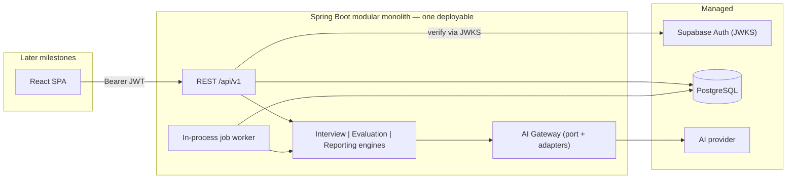

# Architecture

> Current state of the system. Supersedes `06-architecture.md` where they
> differ; the reasoning behind each decision lives in
> [10-architecture-review.md](10-architecture-review.md).
>
> Last updated: M0 + M1.

## 1. Shape

One Spring Boot deployable, one PostgreSQL database, three managed
dependencies. Everything else is a module boundary inside the process.



At Phase 0 the binding constraint is evaluation quality and iteration speed,
not throughput. Every piece of distributed infrastructure not operated is a
week spent on rubrics instead.

**Built so far:** the backend shell, cross-cutting foundation, and the database.
The engines, the gateway and the worker are named here because the module
boundaries that will hold them already exist.

## 2. Modules

Eight modules. `api` is the only package another module may import.

| Module | Owns | May depend on |
|---|---|---|
| `shared` | Errors, tracing, clock, ids, config, security wiring, job queue. **No business rules** | — |
| `identity` | `users` — who the user is, role, status | shared |
| `candidate` | `profiles` — candidate-supplied data | shared |
| `question` | `skills`, question bank, rubrics, templates, publish gates | shared, identity·api |
| `interview` | `interviews`, `interview_questions`, `answers`, the attempt lifecycle | shared, question·api, identity·api, evaluation·api |
| `evaluation` | `evaluations`, `evaluation_criterion_results` | shared, question·api, ai·api |
| `reporting` | `interview_reports`, `report_skill_scores` | shared, interview·api, evaluation·api, question·api, ai·api |
| `ai` | `ai_invocations`, the provider port and adapters | shared |
| `admin` | Cross-module read models, job visibility | shared + every module's `api` |

Two properties are worth defending:

**`evaluation` does not depend on `interview`.** It is handed an answer, a
question version and a rubric. That is what makes it independently testable,
reusable for the admin dry-run tool, and reusable later for assessment outside
an interview.

**`shared` depends on no business module.** A dependency in that direction
means something has been put in the wrong place, and ArchUnit fails the build.

### Enforcement

Boundaries are compile-checked, not aspirational:

| Rule | Prevents |
|---|---|
| A module may reach another only through `<module>.api` | Coupling that makes a future service extraction archaeology |
| `domain` must not depend on `infrastructure` or `api` | Inverted dependencies |
| `api` must not reach into `infrastructure` | Controllers bypassing the use-case layer |
| Controllers must not depend on repositories or entities | Schema leaking into the public contract |
| `domain` must not depend on Spring | Domain types that need a container to construct |
| No `Instant.now()` outside `shared.time` | Untestable time-driven logic |
| No `UUID.randomUUID()` outside `shared.id` | Scattered, unswappable id strategy |
| `@Transactional` only outside `api` and `domain` | Transaction boundaries in the wrong layer |
| No field injection | Objects that cannot be constructed in a plain unit test |

13 rules, all green. Several match nothing yet — they are tripwires for the
milestones that add controllers and repositories, deliberately installed before
there is anything to violate them.

### A consequence worth stating

Because a module's internals are private, **attempt tables reference catalogue
rows by raw `UUID`, not by a JPA association.** A `@ManyToOne` from
`InterviewQuestionEntity` to `QuestionVersionEntity` would be a compile-time
dependency from `interview.domain` into `question.domain` — exactly what the
boundary forbids. This also removes lazy-loading, cascade and N+1 hazards from
the persistence layer entirely.

## 3. Layering inside a module

```
api/             Controllers, request/response DTOs, published interfaces.
                 No business logic, no entities.
application/     Use cases, orchestration, @Transactional, policies, engines.
                 No web types, no provider SDK types.
domain/          Entities, value objects, enums, invariants. No Spring, no I/O.
infrastructure/  Repositories, external adapters, prompt resources, schedulers.
```

Dependency inversion is applied **only across volatility boundaries** — the AI
provider, token verification, the clock, id generation. Four ports, not forty.
Spring Data repository interfaces live in `infrastructure` and are called from
`application` with no hand-written port in between. That is the deliberate line
between clean architecture and ceremony.

Layers are created only when they carry something. A module with no transport
surface yet has no `api` package.

## 4. Cross-module communication

Two mechanisms, deliberately:

1. **Published interfaces** (synchronous, in-process) — a narrow interface in
   the module's `api` package, exchanging its own DTOs. Callers never see a JPA
   entity.
2. **Job rows** (asynchronous) — written in the *same transaction* as the
   business change that triggers them.

Spring's `ApplicationEventPublisher` is deliberately **not** used. It would be a
second async mechanism whose only job was to nudge a worker that polls anyway.

## 5. Asynchronous work

A database-backed queue, chosen over Redis/SQS/Kafka because the job row is
inserted in the same transaction as the answer it grades: no outbox to drift,
no lost job, no extra infrastructure.

```
claim:  SELECT ... WHERE status='QUEUED' AND run_after <= now()
        ORDER BY priority, run_after
        FOR UPDATE SKIP LOCKED LIMIT 5
        -> UPDATE status='RUNNING', locked_by, locked_at, attempts+1
```

Two workers cannot claim the same row: the first holds a row-level write lock,
`SKIP LOCKED` makes the second skip rather than block, and by the time the lock
is released the row is no longer `QUEUED`.

Backoff 5 s → 30 s → 2 min → 10 min (±20% jitter), then `DEAD` and visible in
admin. A job left `RUNNING` with a stale lock for five minutes returns to
`QUEUED`, which is why **every handler must be idempotent** — guaranteed by the
answer, evaluation and report uniqueness constraints.

Three job types: `EVALUATE_ANSWER`, `GENERATE_REPORT`, `MAINTENANCE`.
Follow-up selection is deliberately **not** a job: it is pure computation over
stored rows, and making it one would add latency at the single point where the
candidate is actually waiting.

## 6. Cross-cutting foundation (built)

| Concern | Implementation | Why this shape |
|---|---|---|
| Errors | `GlobalExceptionHandler` → RFC 9457 `ProblemDetail` | One place produces HTTP errors; controllers contain no `try/catch` |
| Error contract | `ErrorCode` enum with a stable `code` string | Clients branch on `code`, never on `title` or status alone |
| Tracing | `TraceIdFilter` → MDC + `X-Trace-Id` + every problem body | A user quotes the id; we find the request |
| Time | Injected `java.time.Clock` | Deadlines and the sweeper are only testable if time is injectable |
| Ids | `IdGenerator` → UUIDv7 | Time-ordered keeps B-tree inserts local; one place to change strategy |
| Config | Validated `@ConfigurationProperties` record | A missing value fails startup, not production at 2 a.m. |
| Security | Default-deny filter chain, stateless, no auth mechanism yet | A new endpoint is closed until someone opens it |

Stack traces, SQL and provider messages are never exposed. Unexpected failures
log in full and return a bare `INTERNAL_ERROR` with the trace id.

## 7. Persistence

**Flyway owns the schema. Hibernate never does.** `ddl-auto` is `validate` and
must stay there: entities are checked against the migrated schema, and a
mismatch in any column name or type fails the context before a test runs.

Entity conventions: no `CascadeType.ALL`, no `EAGER`, no bidirectional
collections, no associations across module boundaries, no setters. At this
milestone entities exist to validate the mapping; explicit queries and DTO
mapping arrive with the services that need them.

Full schema and invariants: [database.md](database.md).

## 8. Testing

| Layer | Approach |
|---|---|
| Architecture | ArchUnit, runs without a database |
| Migrations + mapping | Testcontainers PostgreSQL, or an external database |
| Invariants | Plain JDBC against real PostgreSQL — proving the *database* rejects violations |
| Later: domain policies | Plain JUnit, no Spring |
| Later: web | MockMvc |
| Later: AI adapters | WireMock for HTTP behaviour; a mock adapter elsewhere |
| Later: evaluation quality | Golden-set harness, run on demand |

**PostgreSQL, never H2.** Partial unique indexes, `num_nonnulls`, plpgsql
triggers and `SKIP LOCKED` are all load-bearing; H2 would prove nothing.

## 9. What is deliberately absent

No Kubernetes, no service mesh, no message broker, no CQRS, no event sourcing,
no distributed tracing backend, no circuit breaker, no second AI provider, no
generic idempotency framework, no domain-event bus, no `organizations` table.
Each has a recorded trigger that would justify adding it — see
[10-architecture-review.md](10-architecture-review.md) Part H.
